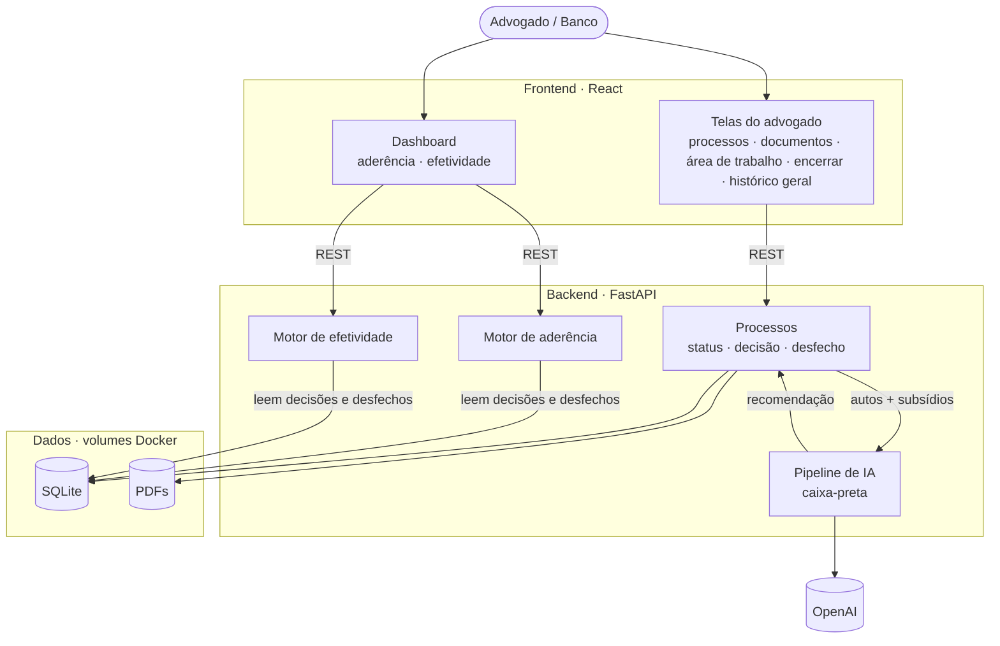
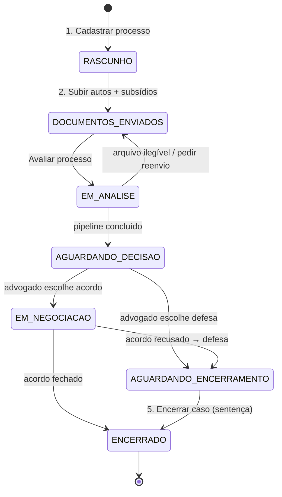
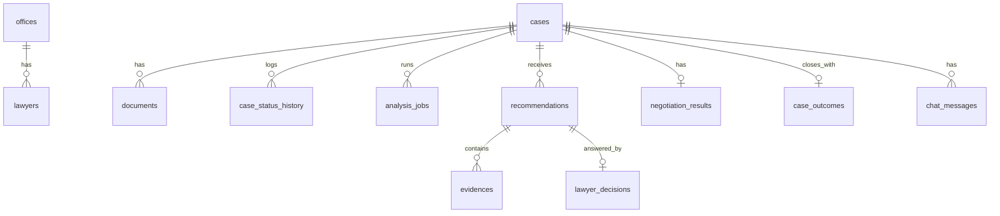
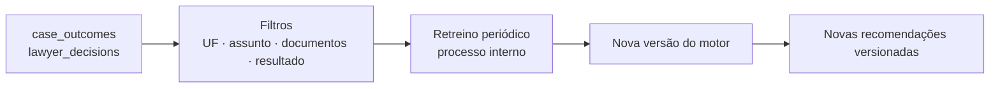

# Arquitetura — Motor de Política de Acordos

> Baseado no board Figma [Hackathon Enter](https://www.figma.com/board/70A3JVeYbKGQhmZjcRdfAO/Hackathon-Enter) — seções **Userflow principal** (Fluxos A/B + Telas 1–4), **Motor de aderência** e **Efetividade / Retroalimentação** (Fluxo C + Tela 5) — e em [`RELATORIO_FLUXO_MOTOR_DECISAO.md`](./RELATORIO_FLUXO_MOTOR_DECISAO.md).
>
> **Status:** arquitetura funcional do MVP. A implementação canônica do backend,
> incluindo estados, métricas e limitações, está em [`BACKEND.md`](./BACKEND.md).
> A arquitetura interna do motor está em
> [`architecture_engine.md`](./architecture_engine.md).
>
> **Visão rápida:** [diagrama de arquitetura (§3)](#3-diagrama-de-arquitetura).

---

## 1. Visão geral

A solução tem três responsabilidades, que viram três módulos do backend:

| Módulo | Pergunta que responde | Quem usa | Telas |
|---|---|---|---|
| **Recomendação** (pipeline de IA) | Acordo ou defesa? Qual valor sugerido? | Advogado | 2, 3 |
| **Aderência** | O advogado seguiu a política? Por que não? | Banco (na demo, também o advogado) | 3, 4, 5 |
| **Efetividade** | A política gera o resultado esperado? | Banco (na demo, também o advogado) | 4, 5 |

> **Decisão para a demo:** um único perfil de usuário. O Dashboard (Tela 5) aparece no menu junto com "Meus processos", assim o vídeo percorre o fluxo inteiro sem troca de login. No produto, a Tela 5 é exclusiva do banco (ver §12).

Princípio central: **a decisão do advogado e o desfecho do caso são eventos registrados**, e não sobrescritas. Aderência e efetividade são calculadas a partir desses eventos.

## 2. Stack

| Camada | Tecnologia | Observação |
|---|---|---|
| Frontend | React + Vite + TypeScript | React Router, TanStack Query (polling do status de análise), Recharts (dashboard) |
| Backend | FastAPI (Python 3.12) | Mesmo runtime do pipeline de IA e dos modelos |
| ORM / schema | SQLModel + `metadata.create_all()` | Sem Alembic no hackathon |
| Banco | SQLite (modo WAL) | Arquivo em volume Docker, não é container próprio |
| Arquivos | Volume local `storage/` | PDFs de autos/subsídios |
| Jobs assíncronos | `BackgroundTasks` do FastAPI + tabela `analysis_jobs` | Sem Redis/Celery para o hackathon |
| LLM | OpenAI API | Chave via `.env` |
| Infra | Docker Compose | Somente a API; frontend roda fora do Compose |

## 3. Diagrama de arquitetura



| Bloco | Responsabilidade |
|---|---|
| **web (React)** | As 5 telas do Figma + Histórico geral. Na demo, o mesmo usuário vê tudo |
| **Processos** | Cadastro, upload e status. Registra a decisão do advogado (aceitou/divergiu) e o desfecho |
| **Pipeline de IA** | Recebe caso + documentos e devolve ação, valor sugerido, confiança e evidências (§5) |
| **Motor de aderência** | Lê as decisões e calcula quanto a política é seguida e os motivos de divergência (§7) |
| **Motor de efetividade** | Lê os desfechos e calcula economia prevista vs. realizada e aceite de acordos (§8) |
| **SQLite + Storage** | Volumes Docker com o banco e os PDFs |

## 4. Userflow → máquina de estados do processo

O Figma define que **status é o estado salvo do processo**. Clicar num processo na Tela 1 retoma de onde ele parou.



Regras:
- Toda transição grava uma linha em `case_status_history`, que alimenta a tela **Histórico geral**. O histórico fica **fora da visão de um processo**: a Tela 3 mostra só o status atual.
- `PROPOSTA_ACEITA` e `DIVERGIU` são propriedades da decisão, não status.
- `ENCERRADO` é somente leitura.
- Contrato ausente **não bloqueia** a análise. Ele entra como lacuna no cálculo (Tela 2).

### Telas → endpoints

| Tela (Figma) | Ações | Endpoints |
|---|---|---|
| **1. Meus processos** | listar, buscar CNJ, filtrar status/prazo/recomendação, cards de resumo | `GET /api/cases`, `GET /api/cases/summary` |
| **2. Cadastrar + documentos** | dados do processo, upload múltiplo, checklist dos 6 subsídios, salvar rascunho, avaliar | `POST /api/cases`, `PATCH /api/cases/{id}`, `POST /api/cases/{id}/documents`, `PATCH /api/documents/{id}` (trocar tipo), `POST /api/cases/{id}/analyze`, `GET /api/cases/{id}/analysis` (polling) |
| **3. Área de trabalho** | recomendação, evidências, PDF, chatbot, decisão e negociação | `GET /api/cases/{id}/workspace`, `GET /api/documents/{id}/file`, `POST /api/cases/{id}/decision`, `POST /api/cases/{id}/negotiation-result`, `GET/POST /api/cases/{id}/chat/messages` |
| **Histórico geral** | linha do tempo de estados, jobs, decisão, negociação e desfecho | `GET /api/history` |
| **4. Encerrar caso** | resultado judicial e custos observados | `POST /api/cases/{id}/closure` |
| **5. Dashboard** | payload composto de operação, aderência e efetividade | `GET /api/dashboard` |

### Casos críticos (Histórico geral)

Visualização padrão da área geral. Lista os processos **abertos** (não `ENCERRADO`) ordenados pelos que mais precisam de atenção. Cada linha mostra os motivos da criticidade como etiquetas, por exemplo `prazo ≤ 5 dias`, `R$ 11.300 em risco` e `confiança baixa`.

Sinais usados, todos já disponíveis nas tabelas (§6):

| Sinal | Fonte |
|---|---|
| Valor em risco | `recommendations.expected_defense_cost` (ou `cases.claim_value` antes da análise) |
| Prazo próximo | `cases.deadline_at` |
| Confiança baixa | `recommendations.confidence` |
| Divergiu da recomendação | `lawyer_decisions.accepted = false` |
| Parado há muito tempo | último `case_status_history.at` |
| Pendência de documento | arquivo ilegível ou erro na análise (`analysis_jobs`) |

A ordenação é calculada no backend por uma regra simples e configurável: primeiro prazo, depois valor em risco, com os demais sinais como desempate. Os pesos exatos ficam em aberto (§12).

## 5. Pipeline de IA — contrato (caixa-preta)

O backend só depende deste contrato. O miolo (extração, risco, severidade, motor
financeiro e política) fica em `src/pipeline/decision_engine/` e é detalhado em
`architecture_engine.md`.

```python
def run_pipeline(case: CaseInput) -> PipelineOutput: ...
```

O risco usa exclusivamente metadados e as seis flags do inventário: disponível = 1, indisponível = 0. O pipeline não valida existência, autenticidade ou validade documental. Qualidade de OCR e observações de conteúdo não alteram flags; não há cenários de contestação.

### Entrada — `CaseInput`

```text
case_id, cnj, uf, assunto, subassunto, valor_causa
subsidy_flags
documents[id, type, path]
```

### Saída — `PipelineOutput`

```text
versions
recommendation[action, confidence_percent, summary, reason_codes]
financial[suggested_offer, expected_defense_cost, expected_savings]
evidences[id, text, type, weight?, sources]
```

- O pipeline sempre devolve `ACORDO` ou `DEFESA`.
- `confidence_percent` é `0..100` ou `null`; não há confiança por evidência.
- Pesos, probabilidades, fórmula financeira e valor sugerido são responsabilidade
  exclusiva da engine e podem vir como campos adicionais.
- A API aceita campos adicionais e persiste a saída inteira como snapshot
  imutável em `recommendations.payload_json`.
- O chatbot recebe o snapshot, evidências e conversa recente, nunca PDFs.
- `POST /analyze` cria um job local e `GET /analysis` fornece polling.

## 6. Modelo de dados (SQLite)



| Tabela | Campos principais | Alimenta |
|---|---|---|
| `offices`, `lawyers` | perfil único de demonstração | autoria |
| `cases` | CNJ, UF, assunto, subassunto, valor, seis flags, status, `is_demo` | fila |
| `case_status_history` | transição, data, ator | histórico |
| `documents` | tipo, nome, caminho, origem | upload e viewer |
| `analysis_jobs` | status, estágio, erro seguro e datas | polling e retry |
| `recommendations` | projeção mínima, versões, payload integral, `is_current` | auditoria e métricas |
| `evidences` | ID externo, tipo, texto, peso opcional e fontes | explicabilidade e chat |
| `lawyer_decisions` | ação, aderência derivada e divergência | aderência |
| `negotiation_results` | aceite e valor final | aceite de acordos |
| `case_outcomes` | desfecho e custos observados | efetividade |
| `chat_messages` | papel, conteúdo, fontes e status | histórico do chat |

Enums e nomes exatos estão em `app/models/domain.py`. As ações são somente
`ACORDO` e `DEFESA`; os motivos de divergência são `FATO_NOVO`,
`ERRO_EXTRACAO`, `VALOR_IRREAL`, `REGRA_CLIENTE` e `OUTRO`.

## 7. Motor de aderência

**Aderência mede comportamento, não resultado.** Ela não altera a recomendação e serve para treino e governança (Figma, Tela 5).

**Captura (Tela 3):** a ação escolhida grava um `lawyer_decisions`.
- `adhered` é derivado da igualdade entre ação escolhida e recomendada.
- Ao divergir, o motivo estruturado é obrigatório.
- A resposta da parte autora só é gravada depois, em `negotiation_results`.

**Métricas** (`app/adherence/service.py`, SQL agregado com os filtros do dashboard):

| Métrica | Definição |
|---|---|
| Aderência geral | `count(accepted) / count(decisões)` |
| Motivos de divergência | distribuição de `divergence_reason` |

Recortes avançados por escritório, confiança e alertas de coorte ficam fora do
MVP do hackathon.

## 8. Motor de efetividade

**Efetividade mede se a política gera o resultado econômico esperado.**

**Captura:** acordo aceito cria um `case_outcomes` diretamente. Defesa ou acordo
recusado aguardam o desfecho judicial em `POST /closure`.

| Métrica | Definição |
|---|---|
| Casos analisados | quantidade de recomendações atuais |
| Economia esperada | `Σ recommendations.expected_savings` |
| Desembolso observado | acordo: valor final + custos; defesa: defesa + condenação + custos |
| Economia do acordo | custo esperado da defesa − desembolso observado |
| Erro da defesa | desembolso observado − custo esperado da defesa |
| Aceite de acordos | negociações aceitas / negociações registradas |

## 9. Retroalimentação (Fluxo C)



- A retroalimentação é **apenas retreino periódico**, offline e em lote — scripts em
  `src/pipeline/training/`: `export_feedback.py` → `train_risk.py --feedback-data` →
  `compare_versions.py`. Não roda na API.
- Toda recomendação guarda o mapa `versions` devolvido pela engine. Uma versão
  nova não reescreve recomendações antigas.
- `export_feedback.py` seleciona casos `ENCERRADO` com `case_outcomes` maduro (≥ N dias,
  para reduzir risco de recurso) e desfecho ≠ `ACORDO` (acordo não é resultado judicial);
  `train_risk.py` concatena esse feedback à base histórica e recusa o retreino abaixo de
  `--min-feedback-n` casos maduros. A candidata é gravada com nome de versão próprio
  (`risco_vN.ubj`/`_meta.json`), nunca sobrescrevendo a versão em produção. Promoção é
  manual, via `ENGINE_RISK_MODEL_VERSION` (`decision_engine/settings.py`) — troca de env
  var, sem editar código, com rollback trivial. Detalhes e comandos:
  [`src/pipeline/README.md`](../src/pipeline/README.md#retreino-periódico-feedback-de-casos-fechados).

## 10. Estrutura de pastas

```
src/
├── web/                          # React + Vite, fora do Compose
├── api/                          # FastAPI
│   ├── app/
│   │   ├── main.py
│   │   ├── core/                 # settings, SQLite e erros
│   │   ├── models/               # tabelas e enums SQLModel
│   │   ├── schemas/              # DTOs HTTP
│   │   ├── routers/              # casos, workflow, histórico, dashboard e chat
│   │   └── services/             # seed, engine, métricas e OpenAI
│   └── Dockerfile
├── contracts/                    # envelope Pydantic compartilhado
└── pipeline/                     # run_pipeline + treino offline
tests/                            # testes de contrato, API e domínio
docker-compose.yml
```

## 11. Docker Compose

```yaml
services:
  api:
    build:
      context: .
      dockerfile: src/api/Dockerfile
    ports: ["8000:8000"]
    volumes:
      - app_db:/app/db
      - app_storage:/app/storage
      - ./data:/app/data:ro
```

O arquivo real inclui health check, todas as variáveis de `.env.example` e os
volumes nomeados. SQLite roda com um worker, WAL e timeout de 30 segundos.

## 12. Decisões em aberto

| # | Decisão | Impacto |
|---|---|---|
| 1 | Baseline de "economia": custo esperado da defesa (modelo) ou valor da causa (sticky do Fluxo C)? | Economia prevista/realizada |
| 2 | ~~Perfis `advogado` e `banco`~~ **Demo:** perfil único e dashboard visível ao advogado. **Pós-demo:** `lawyers.role` (`advogado`/`banco`) + guarda nas rotas `/api/dashboard/*` e no menu | Tela 5 |
| 3 | ~~Período do retreino periódico~~ **Mecanismo implementado** (§9): sob demanda quando `export_feedback.py` acumular casos maduros acima de `--min-feedback-n`; teto sugerido de 1x/semana. Valor exato de `--min-feedback-n` e `--matured-days` seguem em aberto | §9 |
| 4 | Limites dos alertas de padrão (fora do MVP) | evolução do dashboard |
| 5 | Critério de criticidade (fora do MVP) | evolução do histórico |
