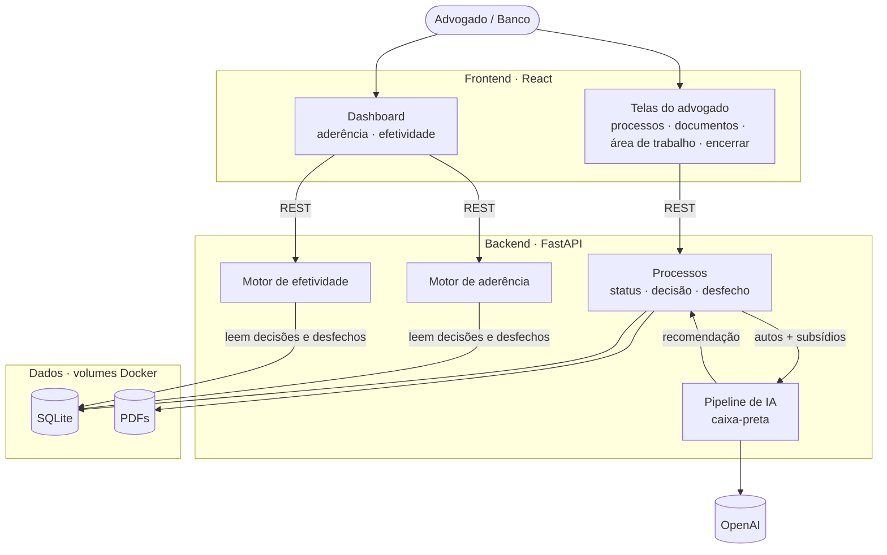
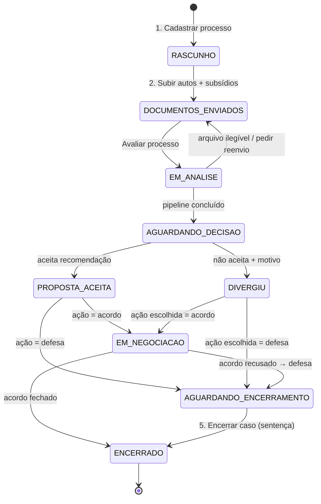
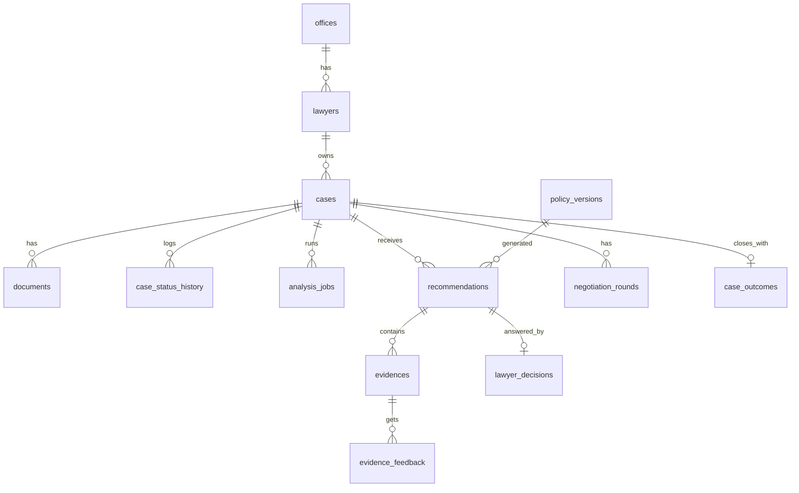
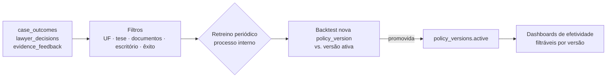

# Arquitetura — Motor de Política de Acordos

> Baseado no board Figma [Hackathon Enter](https://www.figma.com/board/70A3JVeYbKGQhmZjcRdfAO/Hackathon-Enter) — seções **Userflow principal** (Fluxos A/B + Telas 1–4), **Motor de aderência** e **Efetividade / Retroalimentação** (Fluxo C + Tela 5) — e em [`RELATORIO_FLUXO_MOTOR_DECISAO.md`](./RELATORIO_FLUXO_MOTOR_DECISAO.md).
>
> **Status:** rascunho v0. O pipeline de IA está sendo lapidado e será documentado em `.md` próprio; aqui ele aparece como **caixa-preta com contrato de entrada/saída** (§5).
>
> **Visão rápida:** [diagrama de arquitetura (§3)](#3-diagrama-de-arquitetura).

---

## 1. Visão geral

A solução tem três responsabilidades, que viram três módulos do backend:

| Módulo | Pergunta que responde | Quem usa | Telas |
|---|---|---|---|
| **Recomendação** (pipeline de IA) | Acordo ou defesa? Qual faixa de valor? | Advogado | 2, 3 |
| **Aderência** | O advogado seguiu a política? Por que não? | Banco (na demo, também o advogado) | 3, 4, 5 |
| **Efetividade** | A política gera o resultado esperado? | Banco (na demo, também o advogado) | 4, 5 |

> **Decisão para a demo:** um único perfil de usuário. O Dashboard (Tela 5) aparece no menu junto com "Meus processos", assim o vídeo percorre o fluxo inteiro sem troca de login. No produto, a Tela 5 é exclusiva do banco (ver §12).

Princípio central: **a decisão do advogado e o desfecho do caso são eventos registrados**, e não sobrescritas. Aderência e efetividade são calculadas a partir desses eventos.

## 2. Stack

| Camada | Tecnologia | Observação |
|---|---|---|
| Frontend | React + Vite + TypeScript | React Router, TanStack Query (polling do status de análise), Recharts (dashboard) |
| Backend | FastAPI (Python 3.12) | Mesmo runtime do pipeline de IA e dos modelos |
| ORM / migrações | SQLModel (ou SQLAlchemy) + Alembic | Schemas Pydantic compartilhados com a API |
| Banco | SQLite (modo WAL) | Arquivo em volume Docker, não é container próprio |
| Arquivos | Volume local `storage/` | PDFs de autos/subsídios |
| Jobs assíncronos | `BackgroundTasks` do FastAPI + tabela `analysis_jobs` | Sem Redis/Celery para o hackathon |
| LLM | OpenAI API | Chave via `.env` |
| Infra | Docker Compose | 2 serviços: `web` e `api` |

## 3. Diagrama de arquitetura



| Bloco | Responsabilidade |
|---|---|
| **web (React)** | As 5 telas do Figma. Na demo, o mesmo usuário vê tudo |
| **Processos** | Cadastro, upload e status. Registra a decisão do advogado (aceitou/divergiu) e o desfecho |
| **Pipeline de IA** | Recebe autos + subsídios e devolve recomendação, faixa de valor, confiança e evidências (§5) |
| **Motor de aderência** | Lê as decisões e calcula quanto a política é seguida e os motivos de divergência (§7) |
| **Motor de efetividade** | Lê os desfechos e calcula economia prevista vs. realizada, aceite e calibração (§8) |
| **SQLite + Storage** | Volumes Docker com o banco e os PDFs |

## 4. Userflow → máquina de estados do processo

O Figma define que **status é o estado salvo do processo**. Clicar num processo na Tela 1 retoma de onde ele parou.



Regras:
- Toda transição grava uma linha em `case_status_history`, que alimenta o "Histórico do estado" da Tela 3.
- `ENCERRADO` é somente leitura.
- Contrato ausente **não bloqueia** a análise. Ele entra como lacuna no cálculo (Tela 2).

### Telas → endpoints

| Tela (Figma) | Ações | Endpoints |
|---|---|---|
| **1. Meus processos** | listar, buscar CNJ, filtrar status/prazo/recomendação, cards de resumo | `GET /api/cases`, `GET /api/cases/summary` |
| **2. Cadastrar + documentos** | dados do processo, upload múltiplo, checklist dos 6 subsídios, salvar rascunho, avaliar | `POST /api/cases`, `PATCH /api/cases/{id}`, `POST /api/cases/{id}/documents`, `PATCH /api/documents/{id}` (trocar tipo), `POST /api/cases/{id}/analyze`, `GET /api/cases/{id}/analysis` (polling) |
| **3. Área de trabalho** | cartão de recomendação, evidências com citação, PDF viewer, chatbot, aceitar/não aceitar, negociação, histórico | `GET /api/cases/{id}/workspace`, `GET /api/documents/{id}/file`, `POST /api/evidences/{id}/feedback` (confirmar/corrigir), `POST /api/cases/{id}/decision`, `POST /api/cases/{id}/negotiation-rounds`, `POST /api/cases/{id}/chat` |
| **4. Encerrar caso** | como terminou, valores, resumo automático, comentário | `GET /api/cases/{id}/closure-preview`, `POST /api/cases/{id}/closure` |
| **5. Dashboard do banco** (na demo, acessível pelo menu do advogado) | KPIs, economia prevista vs. realizada, motivos de divergência, aderência por escritório, calibração, alertas | `GET /api/dashboard/kpis`, `/economy-timeseries`, `/divergence-reasons`, `/adherence-by-office`, `/calibration`, `/alerts` (todos com os filtros `period, uf, office_id, thesis, confidence, policy_version`) |

## 5. Pipeline de IA — contrato (caixa-preta)

O backend só depende deste contrato. O miolo (OCR, extração, validação, risco, severidade, motor financeiro e política) fica em `src/api/app/pipeline/` e será detalhado no `.md` do pipeline.

```python
def run_pipeline(case: CaseInput) -> PipelineOutput: ...
```

### Entrada — `CaseInput`

```jsonc
{
  "case_id": "uuid",
  "cnj": "0801234-56.2024.8.10.0001",
  "uf": "MA",
  "thesis": "golpe",                 // assunto/subassunto
  "claim_value": 15000.00,           // valor da causa
  "documents": [
    { "document_id": "uuid", "path": "storage/…/03_Extrato.pdf",
      "declared_type": "extrato" | "contrato" | "comprovante_credito" | "dossie"
                     | "demonstrativo_divida" | "laudo_referenciado" | "autos" | null }
  ]
}
```

### Saída — `PipelineOutput`

```jsonc
{
  "versions": { "pipeline": "0.1.0", "risk_model": "…", "severity_model": "…", "policy": "v1.0" },
  "documents": [                     // classificação + qualidade (checklist da Tela 2)
    { "document_id": "uuid", "detected_type": "extrato", "legible": true, "illegible_pages": [] }
  ],
  "subsidy_flags": { "contrato": false, "extrato": true, "comprovante_credito": true,
                     "dossie": true, "demonstrativo_divida": true, "laudo_referenciado": true },
  "evidences": [                     // cards de explicabilidade da Tela 3
    { "kind": "FATO" | "CONTRADICAO" | "LACUNA",
      "text": "Crédito caiu na conta do autor",
      "sources": [{ "document_id": "uuid", "page": 3, "quote": "TED CRÉDITO EMPRÉSTIMO R$ 5.200,00" }],
      "confidence": "alta" | "media" | "baixa",
      "impact": "Se juntado e válido: perda 78% → 26%, decisão vira DEFESA" }
  ],
  "risk": { "p_extincao": 0.1, "p_improcedencia": 0.12, "p_parcial": 0.48, "p_procedencia": 0.3,
            "cohort_size": 9946 },
  "financial": { "expected_defense_cost": 11300, "expected_savings": 6950,
                 "settlement_range": { "opening": 3750, "target": 4350, "ceiling": 9800 } },
  "recommendation": {
    "action": "ACORDO" | "DEFESA",   // sempre binária — não há revisão humana
    "confidence": "alta" | "media" | "baixa",
    "confidence_score": 0.83,        // usado na calibração (Tela 5)
    "reason_codes": ["BAIXA_CONFIANCA", "EVIDENCIA_CONTRADITORIA", …], // alertas exibidos no cartão, não mudam a ação
    "summary": "prova — contrato ausente, assinatura divergente · risco — perda 78% …",
    "what_changes": ["contrato válido → DEFESA", "pedido acima de R$ 9.800 → DEFESA"]
  },
  "errors": [{ "code": "ARQUIVO_ILEGIVEL", "document_id": "uuid" }]
}
```

- **Sem revisão humana:** o pipeline sempre devolve `ACORDO` ou `DEFESA`. Casos incertos (baixa confiança, evidência contraditória, intervalos sobrepostos) saem com `confidence: baixa` e `reason_codes` visíveis no cartão. Quem decide é o advogado, que pode aceitar ou divergir. Isso difere do relatório do motor (§6.4), que previa uma terceira ação.
- A saída inteira é persistida como snapshot imutável em `recommendations.payload_json`, junto com as `versions`. Isso garante a auditoria e o backtest.
- O chatbot (`POST /cases/{id}/chat`) recebe o snapshot e os trechos dos documentos. Toda resposta tem que citar documento e página.
- Execução assíncrona: `POST /analyze` cria um `analysis_jobs` com status `queued`, e o pipeline vai atualizando `progress` e `stage` (OCR, extração, validação, risco, motor financeiro). A Tela 1/2 faz polling.

## 6. Modelo de dados (SQLite)



| Tabela | Campos principais | Alimenta |
|---|---|---|
| `offices` | id, name | filtro/aderência por escritório |
| `lawyers` | id, office_id, name, email | autoria |
| `cases` | id, cnj (unique), uf, thesis, claim_value, lawyer_id, status, deadline_at, created_at | Tela 1 |
| `case_status_history` | case_id, from_status, to_status, at, actor | histórico (Tela 3), tempo por etapa |
| `documents` | id, case_id, path, filename, declared_type, detected_type, legible, illegible_pages_json | checklist (Tela 2) |
| `analysis_jobs` | id, case_id, status, stage, progress, error, started_at, finished_at | loading/polling |
| `policy_versions` | id (`v1.0`), params_json, created_at, active | filtro "versão da política", backtest |
| `recommendations` | id, case_id, policy_version_id, action, confidence, confidence_score, range_opening/target/ceiling, expected_defense_cost, expected_savings, reason_codes_json, payload_json, created_at | **aderência + efetividade** |
| `evidences` | id, recommendation_id, kind, text, sources_json, confidence | cards (Tela 3) |
| `evidence_feedback` | evidence_id, lawyer_id, verdict (`confirmado`/`corrigido`), correction | erro de extração |
| `lawyer_decisions` | recommendation_id, lawyer_id, accepted (bool), chosen_action, divergence_reason, divergence_note, decided_at | **motor de aderência** |
| `negotiation_rounds` | case_id, round, offer_value, counter_value, at | aceite, rodadas |
| `case_outcomes` | case_id, outcome (`acordo`/`improcedencia`/`extincao`/`parcial`/`procedencia`), final_amount, fees, costs, closed_at, comment | **motor de efetividade** |

Enums:
- `divergence_reason`: `DOCUMENTO_INVALIDO`, `FATO_NOVO`, `ERRO_EXTRACAO`, `VALOR_IRREAL`, `OUTRO` (Tela 3).
- `thesis`: `GOLPE`, `GENERICO`.

## 7. Motor de aderência

**Aderência mede comportamento, não resultado.** Ela não altera a recomendação e serve para treino e governança (Figma, Tela 5).

**Captura (Tela 3):** "Você aceita a proposta?" grava um `lawyer_decisions`.
- **Aceitar**: `accepted=true` e `chosen_action = recommendation.action`, status `PROPOSTA_ACEITA`.
- **Não aceitar**: abre o modal de divergência. Motivo estruturado obrigatório, texto livre e ação escolhida, status `DIVERGIU`.

**Métricas** (`app/adherence/service.py`, SQL agregado com os filtros do dashboard):

| Métrica | Definição |
|---|---|
| Aderência geral | `count(accepted) / count(decisões)` |
| Aderência por tipo | idem, agrupado por `recommendation.action` |
| Aderência por escritório | idem, agrupado por `offices.id` + economia realizada do escritório |
| Motivos de divergência | distribuição de `divergence_reason` (por escritório, UF, tese) |
| Acordo fora da faixa | `final_amount > range_ceiling` em casos de acordo |
| Tempo até decisão | `decided_at − AGUARDANDO_DECISAO.at` |
| Aderência por confiança | aderência agrupada por `confidence`. Divergência alta em `alta` indica problema na política ou na extração |

**Alertas de padrão:** um job simples, que roda sob demanda ou quando o dashboard carrega, procura coortes (UF × tese × flags de subsídios) com `n ≥ N_MIN` e divergência `≥ X%`. Ele retorna o motivo dominante e aponta pra "abrir backtest". Exemplo do Figma: *AM + Golpe com contrato: 40% de divergência, motivo documento inválido*.

## 8. Motor de efetividade

**Efetividade mede se a política gera o resultado econômico esperado.**

**Captura (Tela 4, Encerrar caso):** grava `case_outcomes` e status `ENCERRADO`. O resumo automático junta a recomendação, a decisão, as rodadas e o resultado.

| Métrica | Definição |
|---|---|
| Casos analisados | `count(recommendations)` no período |
| Economia prevista | `Σ recommendations.expected_savings` |
| Economia realizada | `Σ (expected_defense_cost − custo_real)`, com `custo_real = final_amount + fees + costs` |
| Erro do motor financeiro | prevista − realizada por mês (área sombreada do gráfico) |
| Aceite de acordos | `acordos fechados / casos que foram para negociação` |
| Taxa de êxito / não êxito | por UF, tese, documentos, escritório (Fluxo C) |
| Calibração da confiança | para cada faixa `alta/media/baixa`: % em que a ação recomendada se mostrou correta vs. o esperado (≥90%, 70–90%, <70%) |

> ⚠️ **"Ação correta" precisa de definição fechada** (ver §11). Casos acordados não revelam o resultado da defesa, e vice-versa (viés de seleção, conforme o relatório §10).

## 9. Retroalimentação (Fluxo C)



- O retreino é **offline e em lote** (notebook/script em `src/pipeline/training/`). Não roda na API.
- Toda recomendação guarda sua `policy_version`. Uma versão nova não reescreve as recomendações antigas.
- Backtest: roda a versão candidata sobre os snapshots de casos encerrados e compara com a economia realizada.

## 10. Estrutura de pastas

```
src/
├── web/                          # React + Vite
│   ├── src/
│   │   ├── pages/
│   │   │   ├── CasesList/        # Tela 1
│   │   │   ├── CaseNew/          # Tela 2 (stepper)
│   │   │   ├── Workspace/        # Tela 3
│   │   │   └── BankDashboard/    # Tela 5
│   │   ├── components/           # RecommendationCard, EvidenceCard, PdfViewer,
│   │   │                         # Chat, DivergenceModal, CloseCaseModal (Tela 4)
│   │   ├── api/                  # client + hooks TanStack Query
│   │   └── types/                # gerado do OpenAPI (openapi-typescript)
│   └── Dockerfile
├── api/                          # FastAPI
│   ├── app/
│   │   ├── main.py
│   │   ├── core/                 # config, db (SQLite WAL), storage
│   │   ├── models/               # SQLModel (tabelas §6)
│   │   ├── schemas/              # Pydantic (CaseInput, PipelineOutput, DTOs)
│   │   ├── routers/              # cases, documents, decisions, closure, chat, dashboard
│   │   ├── services/             # cases (máquina de estados), analysis_jobs
│   │   ├── pipeline/             # 🔲 caixa-preta — run_pipeline()
│   │   ├── adherence/            # métricas + alertas
│   │   └── effectiveness/        # métricas + calibração
│   ├── migrations/               # Alembic
│   ├── seeds/                    # casos de exemplo (data/Caso_01, Caso_02) + escritórios
│   ├── tests/
│   └── Dockerfile
└── pipeline/
    └── training/                 # retreino/backtest offline
docker-compose.yml
```

## 11. Docker Compose

```yaml
services:
  api:
    build: ./src/api
    env_file: .env
    environment:
      DATABASE_URL: sqlite:////app/db/app.db
      STORAGE_DIR: /app/storage
    volumes:
      - ./db:/app/db
      - ./storage:/app/storage
      - ./data:/app/data:ro        # base histórica + casos exemplo
    ports: ["8000:8000"]
    command: >
      sh -c "alembic upgrade head && python -m seeds.run &&
             uvicorn app.main:app --host 0.0.0.0 --port 8000"

  web:
    build: ./src/web
    environment:
      VITE_API_URL: http://localhost:8000
    ports: ["5173:5173"]
    depends_on: [api]
```

`.env.example`:

```env
OPENAI_API_KEY=
DATABASE_URL=sqlite:////app/db/app.db
STORAGE_DIR=/app/storage
POLICY_VERSION=v1.0
```

**SQLite:** um único worker do uvicorn, `PRAGMA journal_mode=WAL` e `busy_timeout`. É suficiente pro volume da demo. Se for pra produção, troca por Postgres mudando só o `DATABASE_URL`.

## 12. Decisões em aberto

| # | Decisão | Impacto |
|---|---|---|
| 1 | Definição de "recomendação correta" para calibração (acordo fechado ≤ teto? defesa com improcedência/extinção?) | Tela 5, calibração |
| 2 | Baseline de "economia": custo esperado da defesa (modelo) ou valor da causa (sticky do Fluxo C)? | Economia prevista/realizada |
| 3 | ~~Perfis `advogado` e `banco`~~ **Demo:** perfil único e dashboard visível ao advogado. **Pós-demo:** `lawyers.role` (`advogado`/`banco`) + guarda nas rotas `/api/dashboard/*` e no menu | Tela 5 |
| 4 | Período e gatilho do retreino (Fluxo C: "definir períodos") | §9 |
| 5 | ~~Revisão humana~~ **Decidido:** não existe. Ação sempre `ACORDO`/`DEFESA`, e a incerteza aparece como confiança + `reason_codes` | — |
| 6 | Limites `N_MIN` e `X%` dos alertas de padrão | §7 |
| 7 | Fluxo de negociação: o advogado registra cada rodada ou só o valor final? | `negotiation_rounds` |
