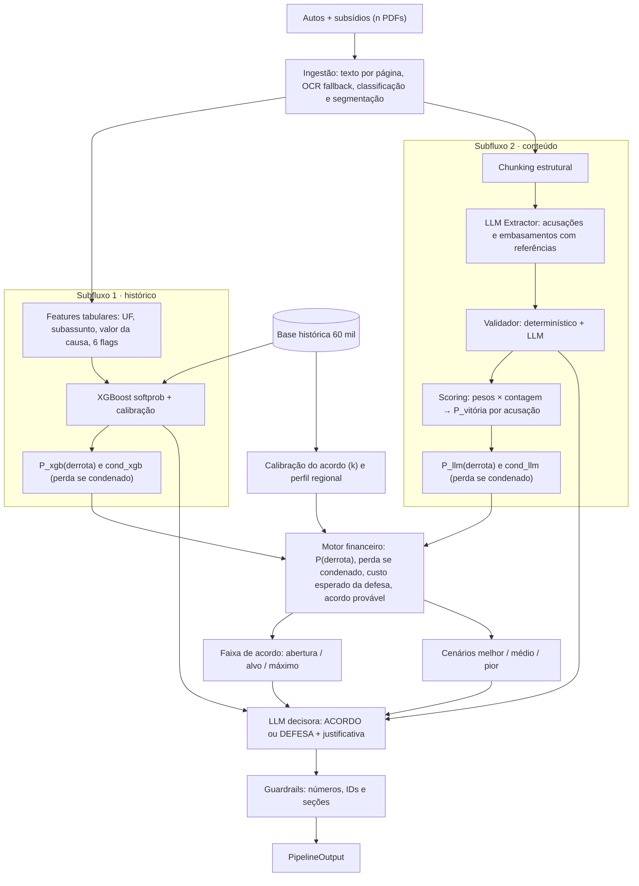

# Plano v2 — Engine de IA

> Organiza a arquitetura definida pela equipe: extração de PDF com OCR, subfluxo histórico com XGBoost, subfluxo de conteúdo com LLM e motor financeiro. O sistema calcula o **custo esperado da defesa**, a **faixa de acordo** (abertura, alvo, máximo) e os cenários melhor/médio/pior; uma **LLM decisora** escolhe entre ACORDO e DEFESA.
>
> **Atualização:** a regra fixa `ACORDO se alvo ≤ teto` foi removida. A decisão passou para a LLM decisora (§5.4 e §6), e a ordem de implementação e os prompts estão em [`PLANO_IMPLEMENTACAO_ENGINE.md`](PLANO_IMPLEMENTACAO_ENGINE.md).
>
> As estatísticas e simulações da base histórica foram recalculadas nesta análise. Pesos, α/β, `T`, probabilidades-base, custo de negociação e tetos de confiança são **valores iniciais a calibrar**, não resultados.

---

## 0. Visão geral



### Princípios

1. **A LLM lê, classifica, decide e redige; os números são do sistema.** Pesos, probabilidades, valores, faixa de acordo e confiança são calculados deterministicamente. A LLM decisora escolhe a ação e escreve a justificativa sobre esses números, sem alterá-los.
2. **Toda afirmação tem fonte localizável:** documento, página, trecho literal, posição no texto e regex gerada pelo sistema.
3. **Os subfluxos são independentes.** O XGBoost vê só metadados e flags; o subfluxo LLM vê só conteúdo. Nenhum recebe a saída do outro, senão α/β contaria a mesma informação duas vezes. Eles só se encontram no motor financeiro e na LLM decisora.
4. **A decisão compara alternativas.** A LLM decisora recebe o custo esperado da defesa, a faixa de acordo, os cenários e a robustez econômica. Decidir contra a comparação econômica exige justificativa explícita.
5. **A degradação é controlada.** Falha de OCR ou de LLM reduz o peso do subfluxo e a confiança, mas não derruba a análise.

---

## 1. Pontos de atenção no esboço

| # | Ponto do esboço | Problema | Solução adotada |
|---|---|---|---|
| P1 | Decidir por `custo / valor da causa > 0,6` | Compara a exposição com uma fração fixa e ignora quanto o acordo custaria. Na simulação, só funcionava com a condenação superestimada (dois erros se compensando); com a severidade correta, a economia caía para 29% | O sistema calcula acordo provável, custo esperado da defesa e robustez econômica (§5.4); a LLM decisora escolhe a ação (§6). O 0,6·VC vira **alçada** |
| P2 | Condenação = 100% do valor da causa | Na base, a condenação média é 62% do VC em parcial e 90% em procedência | Severidade histórica como padrão (§3.4) |
| P3 | Peso × quantidade de itens | A LLM pode quebrar um fato em vários itens e inflar a soma | Dedup no validador e teto de 3 itens contados por categoria |
| P4 | Soma → probabilidade | A soma é ilimitada e não tem ponto de partida | Função logística com prior histórico e escala `T` (§4.6). Equivale a uma regressão logística com coeficientes definidos pela equipe |
| P5 | Acusações tratadas como independentes | Dano moral e material só existem se o contrato for declarado inexistente | Acusação principal + acusações dependentes com probabilidade condicional (§4.6) |
| P6 | "Mais lacunas = melhor para o banco" | Há lacunas dos dois lados: do autor (B.O. citado e não juntado) e do banco (liveness não localizado) | Categorias separadas com polaridades opostas (§4.4) |
| P7 | Regex referenciando o arquivo | Regex gerada por LLM é frágil, e uma lacuna de ausência não tem trecho para citar | A LLM devolve trecho literal; o sistema localiza, grava a posição e gera a regex (§4.3) |
| P8 | Flags extraídas dos PDFs | Na base, a flag significa subsídio **do banco** disponibilizado | Flag = existe documento daquele tipo com origem banco. Anexos do autor não contam |
| P9 | Subassunto extraído do texto | O critério Golpe × Genérico da base é desconhecido e muda a taxa de derrota em cerca de 20 pp | A LLM classifica com evidências; se ambíguo, usa a média 50/50 das duas previsões |
| P10 | α + β = 1 | Só faz sentido com estimadores independentes e na mesma escala | Combinação de P(derrota) e perda se condenado separadamente, com escala comum e diagnóstico de divergência (§5.1) |
| P11 | Custo de defesa = 5% da estimativa | Sendo proporcional, um caso de risco ~0 teria custo de defesa ~0 | Piso opcional `custo_defesa_minimo` (default 0) |
| P12 | LLM estima a faixa de acordo | Sem dados de negociação, a LLM inventaria valores | A faixa sai de k calibrado em 280 acordos (§5.3). A LLM decisora escolhe a ação e escreve a estratégia sem alterar a faixa (§6) |
| P13 | Pesos iniciais | Dois casos não validam pesos | Sensibilidade, simulação histórica e pesos versionados |
| P14 | Acordo derivado da condenação estimada | Sobre a **perda esperada**, gera ofertas abaixo de qualquer acordo já aceito em 73,6% dos casos e deixa a decisão circular | Acordo = k × **perda se condenado** (§5.3) |

---

## 2. Etapa comum — Ingestão

### 2.1 Texto por página e OCR

- **Leitura:** `pdfplumber`, com texto, layout e tabelas por página.
- **Decisão de OCR por página**, já que PDFs mistos são comuns (petição digital com RG escaneado). Uma página vai para OCR se:
  - tem menos de 50 caracteres úteis;
  - tem mais de 80% da área ocupada por imagem; ou
  - tem texto corrompido (`(cid:NN)` ou alta proporção de caracteres fora do alfabeto).
- **OCR:** renderização em 300 dpi com `pypdfium2` e Tesseract no idioma `por`. A confiança média das palavras vira `qualidade_ocr` da página.
- **Limpeza:** remover cabeçalhos e rodapés repetidos (linhas em ≥ 50% das páginas, como "Processo nº … Página N"), juntar hifenização e normalizar espaços, **mantendo um mapa de offsets para a página original**.
- **Teste de OCR:** os PDFs dos casos exemplo são digitais. Rasterizar esses mesmos PDFs e comparar a saída do OCR com a do texto nativo.

### 2.2 Classificação e segmentação

- **Tipo e origem de cada documento:**
  - origem banco: `contrato`, `extrato`, `comprovante_credito`, `dossie`, `demonstrativo_divida`, `laudo_referenciado`;
  - origem autos: `peticao_inicial`, `procuracao`, `documento_pessoal`, `comprovante_residencia`, `boletim_ocorrencia`, `extrato_autor`, `decisao`, `outro`.
- **Método:** regras de cabeçalho primeiro ("CÉDULA DE CRÉDITO BANCÁRIO", "DEMONSTRATIVO DE EVOLUÇÃO DA DÍVIDA", "LAUDO REFERENCIADO", "DOSSIÊ DE VERIFICAÇÃO", "COMPROVANTE DE OPERAÇÃO DE CRÉDITO", "Extrato de Conta", "EXCELENTÍSSIMO", "PROCURAÇÃO", "Anexo à petição inicial – juntada pela parte autora"). Um modelo menor serve de fallback.
- **Segmentação dos autos:** os autos chegam em um PDF com várias peças e são segmentados por página. Nos casos exemplo: petição nas p. 1–5, procuração na p. 6, RG na p. 7 e comprovante de residência na p. 8.

---

## 3. Subfluxo 1 — Features tabulares e XGBoost

### 3.1 Features da planilha e como extraí-las

| Coluna da base | Uso no modelo | Extração | Verificação |
|---|---|---|---|
| UF | Categórica | Segmento `TR` do nº CNJ (`NNNNNNN-DD.AAAA.8.TR.OOOO`), com a tabela dos 27 TJs | Bate 100% com a coluna UF nos 60 mil processos. Conferir com "COMARCA DE …/UF" |
| Assunto | Não entra (constante) | LLM confirma que é "não reconhece operação" | Fora do escopo → `FORA_DO_ESCOPO`, sem recomendação |
| Sub-assunto | Binária | LLM classifica a petição e cita trechos. Golpe: narra fraude de terceiro. Genérico: só nega a contratação | Ambíguo → média 50/50 das previsões + `SUBASSUNTO_AMBIGUO` |
| Valor da causa | Numérica, testada com e sem | Regex "Dá-se à causa o valor de R$ …", com LLM de fallback | Comparar com a soma dos valores pedidos (§4.7) |
| 6 subsídios | Binárias | Classificação da §2.2, só origem banco | Divergência com o checklist do cadastro → alerta |
| Resultado micro/macro e valor da condenação | Alvo / não usar | — | Seriam vazamento se usados como feature |

Valores esperados nos casos exemplo:
- **Caso 01:** MA, VC R$ 20.000, flags `111111`.
- **Caso 02:** AM, VC R$ 25.000, flags `001011`.

### 3.2 Treino

- **Dados:** 59.720 processos, excluindo os 280 acordos, que não são desfecho judicial. Alvo: `extincao`, `improcedencia`, `parcial`, `procedencia`.
- **Divisão:** estratificada por classe × UF, com 70% treino, 15% calibração e 15% teste. O early stopping usa validação interna do treino, nunca o conjunto de calibração.
- **Modelo:** `XGBClassifier(objective="multi:softprob", eval_metric="mlogloss", tree_method="hist", enable_categorical=True)`.
- **Busca de hiperparâmetros:** pequena, em `max_depth` (2–6), `learning_rate`, `min_child_weight`, `subsample`, `colsample_bytree` e `reg_lambda`, com CV de 5 folds.
- **Sem pesos de classe nem oversampling.** Eles distorcem as probabilidades que o motor financeiro usa.
- **Baselines obrigatórios:** prior (log loss 1,244) e regressão logística multinomial (0,934). O XGBoost precisa empatar ou superar. Se só empatar, pode ser mantido pelas interações UF × flags, com o empate registrado.

### 3.3 Calibração e confiança do modelo

- **Calibração:** comparar no teste três opções — sem calibração, temperature scaling e isotônica one-vs-rest renormalizada. Escolher por log loss e ECE.
- **Relatório:** log loss, Brier multiclasse, ECE por classe, diagramas de confiabilidade, AUC de vitória × derrota e métricas por UF.
- **Confiança do subfluxo 1:**
  - probabilidades calibradas;
  - `certeza_modelo = 1 − H(p)/ln 4`;
  - `suporte`: nº de processos com mesma UF, subassunto e flags; abaixo de 30, emite `COORTE_PEQUENA`;
  - fora da distribuição: UF sem histórico (RR) usa a média das previsões nas 26 UFs; VC fora de R$ 1.000–30.979 gera alerta.

### 3.4 Saídas para o motor financeiro

```text
P_xgb    = P_parcial + P_procedencia
cond_xgb = VC · (P_parcial · s_parcial + P_procedencia · s_procedencia) / P_xgb
```

- `cond_xgb` é a **perda se condenado**: quanto o banco paga, em média, dado que perde.
- **Severidade histórica** (média condenação/VC): `s_parcial = 0,62` e `s_procedencia = 0,90`. O P90 da procedência (0,98) alimenta o pior caso.
- Extinção e improcedência não geram pagamento.

### 3.5 Explicação

O efeito de cada feature é medido por marginalização, em pontos percentuais de P(derrota):

```text
Δ_UF = P_derrota(caso) − média das P_derrota(caso com cada uma das 26 UFs)
```

O mesmo cálculo vale para subassunto e para cada flag. O resultado alimenta o contexto regional (§7) e a justificativa.

---

## 4. Subfluxo 2 — LLM Extractor, validador e scoring

### 4.1 Chunking

Documentos jurídicos têm estrutura forte. O corte deve seguir essa estrutura, não um tamanho fixo.

1. **Blocos:** parágrafos e tabelas por página, com offsets.
2. **Seções lógicas:**
   - petição: títulos (`^[IVX]+ – DOS/DAS …`) e subseções (`II.1`), com "DOS FATOS", "DO DIREITO", "DA TUTELA" e "DOS PEDIDOS" isolados;
   - subsídios: seções numeradas e quadros chave-valor;
   - tabelas longas (demonstrativo, extrato): um parser determinístico gera linhas estruturadas e um resumo textual. A LLM recebe o resumo, não as 84 linhas.
3. **Montagem:**
   - agrupar blocos consecutivos da mesma seção até ~1.000 tokens (máximo 1.500);
   - nunca cortar parágrafo nem linha de tabela; parágrafo gigante é dividido por frase;
   - sobreposição de um parágrafo (≤ 150 tokens) só quando uma seção é dividida.
4. **Cabeçalho contextual** em cada chunk, por exemplo `[D02 · Contrato · seção 4 Canal de contratação · pág. 2]`.
5. **ID:** `{documento}:p{página}:c{n}`.

A estratégia de envio depende do tamanho do caso, contado com `tiktoken`:

| Modo | Quando | Como |
|---|---|---|
| Contexto integral | Caso ≤ 40 mil tokens após limpeza (os casos exemplo têm ~12–15 mil) | Todos os chunks marcados, em uma chamada por acusação. É o modo preferível, porque contradições entre autos e subsídios exigem os dois no mesmo contexto |
| Map-reduce | Caso maior | (1) Acusações extraídas só de "DOS FATOS" + "DOS PEDIDOS". (2) *Map*: lotes de ~10 mil tokens geram itens candidatos com chunk e trecho. (3) *Reduce*: por acusação, juntar os candidatos, recuperar chunks relevantes (roteamento por tipo de documento + BM25/embeddings) e consolidar |

Roteamento mínimo de documentos por acusação:
- **Inexistência:** contrato, dossiê, laudo, comprovante, extrato e petição.
- **Dano material:** demonstrativo, extrato e pedidos.
- **Dano moral:** fatos, pedidos e perfil do autor.

### 4.2 LLM Extractor

**Passos:**
1. **Acusações.** Lê "DOS FATOS" e "DOS PEDIDOS" e devolve tipo, descrição, dependência, forma do pedido (valor explícito, "a arbitrar" ou em dobro) e trechos. Pedidos processuais (tutela, gratuidade, inversão do ônus, custas e honorários) são registrados sem pontuação.
2. **Embasamentos por acusação**, em chamadas paralelas. Todas as categorias permitidas para o tipo são preenchidas, e ficam vazias quando não houver itens.
3. **Cronologia.** Datas de contratação, crédito, primeiro desconto, ciência, B.O./reclamação e ajuizamento.

**Regras do prompt:**
- Saída estruturada com JSON Schema estrito gerado dos modelos Pydantic, temperatura 0, modelo via `OPENAI_MODEL` e prompts versionados.
- Cada item tem título curto, descrição, justificativa (por que ajuda ou prejudica o banco nesta acusação) e pelo menos uma referência.
- O campo `trecho` é cópia **literal** do chunk (até 300 caracteres) e vem com o `chunk_id`.
- A LLM não gera pesos, probabilidades, confiança nem valores calculados.
- Um fato atômico por item. O mesmo fato não aparece em duas categorias da mesma acusação.

### 4.3 Estrutura do JSON

Exemplo com trechos reais do Caso 02, abreviado:

```json
{
  "versao_schema": "extrator-v1",
  "caso": {
    "cnj": "0654321-09.2024.8.04.0001",
    "no_escopo": true,
    "sub_assunto": {
      "valor": "GOLPE",
      "ambiguo": false,
      "referencias": [
        { "tipo": "trecho", "chunk_id": "D01:p1:c3",
          "trecho": "configurando evidente caso de contratação fraudulenta em seu nome" }
      ]
    },
    "cronologia": [
      { "evento": "contratacao", "data": "2023-07-18", "referencias": [] }
    ]
  },
  "acusacoes": [
    {
      "id": "ACU-01",
      "tipo": "inexistencia_contratacao",
      "descricao": "Declaração de inexistência do débito e do contrato nº 603827451",
      "depende_de": null,
      "pedido": { "forma": "sem_valor_monetario", "referencias": [] },
      "embasamentos": {
        "provas_contratacao": [],
        "autenticacao_forte": [],
        "registros_digitais": [
          {
            "id": "EMB-003",
            "titulo": "Dispositivo identificado por device fingerprint",
            "descricao": "O laudo registra o dispositivo da contratação por fingerprint",
            "justificativa": "Indica uso de um dispositivo identificado, mas sem biometria não comprova sozinho a autoria",
            "referencias": [
              { "tipo": "trecho", "chunk_id": "D04:p1:c4",
                "trecho": "Dispositivo: identificado por device fingerprint (hash DFP-9A43E1B7)" }
            ]
          }
        ],
        "lacunas_argumentativas_autor": [
          {
            "id": "EMB-007",
            "titulo": "Boletim de ocorrência citado como anexo e não juntado",
            "descricao": "A petição diz juntar o B.O. nº 2024.005432, mas os anexos são procuração, RG e comprovante de residência",
            "justificativa": "A alegação de fraude perde suporte probatório sem o registro policial",
            "referencias": [
              { "tipo": "trecho", "chunk_id": "D01:p2:c1",
                "trecho": "Boletim de Ocorrência nº 2024.005432 - cópia em anexo" },
              { "tipo": "ausencia_documental",
                "documentos_esperados": ["boletim_ocorrencia"],
                "documentos_verificados": ["D01:p6", "D01:p7", "D01:p8"] }
            ]
          }
        ],
        "lacunas_probatorias_banco": [
          {
            "id": "EMB-011",
            "titulo": "Vídeo de liveness não localizado",
            "descricao": "O laudo informa que o vídeo de biometria facial não foi encontrado nos arquivos",
            "justificativa": "Sem a biometria, o banco não demonstra que o próprio autor fez a contratação digital",
            "referencias": [
              { "tipo": "trecho", "chunk_id": "D04:p2:c3",
                "trecho": "não foi localizado nos arquivos digitais o vídeo de liveness" }
            ]
          }
        ],
        "indicios_de_fraude": [],
        "inconsistencias_documentos_banco": []
      }
    },
    {
      "id": "ACU-03",
      "tipo": "dano_moral",
      "descricao": "Indenização por danos morais",
      "depende_de": "ACU-01",
      "pedido": {
        "forma": "valor_explicito",
        "valor_texto": "R$ 18.000,00",
        "referencias": [
          { "tipo": "trecho", "chunk_id": "D01:p4:c5", "trecho": "danos morais no valor de R$ 18.000,00" }
        ]
      },
      "embasamentos": {
        "agravantes_dano_moral": [],
        "vulnerabilidade_autor": [],
        "atenuantes_dano_moral": [],
        "lacunas_argumentativas_autor": []
      }
    }
  ],
  "pedidos_processuais": [
    { "tipo": "tutela_urgencia", "descricao": "Suspensão imediata dos descontos", "referencias": [] }
  ]
}
```

**Pós-processamento das referências pelo sistema:**
1. Normalizar o texto (espaços, hifenização, NFKC) e buscar o trecho no chunk. Se não achar, usar `rapidfuzz` com similaridade ≥ 90.
2. **Referência encontrada:** grava `documento_id`, `pagina`, `char_inicio`, `char_fim`, `similaridade`, `localizado: true` e `regex` (tokens escapados unidos por `\s+`).
3. **Referência não encontrada:** o item recebe `referencia_nao_localizada` e sai da contagem, mas continua no log.
4. **`ausencia_documental`:** o sistema confirma que os tipos listados em `documentos_esperados` realmente não estão no pacote.

**Campos acrescentados depois:**
- validador: `validacao: { status, motivo }` em cada item;
- scoring: `{ peso, n_itens, n_contado, contribuicao }` por categoria e `{ score, p_vitoria_condicional, p_vitoria, valor_pedido, perda_se_condenado }` por acusação.

### 4.4 Taxonomia de acusações e embasamentos, com pesos iniciais

Peso positivo favorece o banco; negativo favorece o autor. No máximo 3 itens contam por categoria.

**A0 · `inexistencia_contratacao`** — acusação principal. Valor monetário 0; o saldo devedor é informado à parte.

| Categoria | Peso | O que entra |
|---|---:|---|
| `provas_contratacao` | +3 | Instrumento assinado, gravação com aceite, autorização de consignação com retorno do INSS |
| `autenticacao_forte` | +3 | Grafotécnica compatível, biometria/liveness confirmada, documentos validados em bases oficiais |
| `registros_digitais` | +1 | Aceite eletrônico, senha, IP, device fingerprint, geolocalização sem biometria |
| `credito_em_conta_do_autor` | +2 | Crédito em conta de titularidade comprovada do autor |
| `uso_do_credito_pelo_autor` | +2 | Saques, transferências para mesma titularidade ou familiares, pagamentos |
| `contradicoes_do_autor` | +2 | Alegação desmentida por documento |
| `lacunas_argumentativas_autor` | +1 | Alegação relevante sem prova (lista abaixo) |
| `comportamento_do_autor` | +1 | Inércia longa, parcelas pagas sem contestação |
| `questoes_processuais` | +2 | Prescrição, inépcia, ilegitimidade, falta de documento indispensável |
| `fatos_comprovados_autor` | −2 | B.O. juntado, reclamação comprovada, prova de conta em outro banco |
| `lacunas_probatorias_banco` | −3 | Contrato ausente, assinatura não periciada, liveness ausente ou não localizado, gravação ausente |
| `indicios_de_fraude` | −3 | Crédito em conta não reconhecida, dados cadastrais divergentes, canal incompatível com o perfil, geolocalização distante |
| `inconsistencias_documentos_banco` | −2 | Divergência entre subsídios, documento citado e não disponibilizado, forma de assinatura incompatível com o canal |

**A1 · `dano_material`** — depende de A0.

| Categoria | Peso | O que entra |
|---|---:|---|
| `fatos_comprovados_autor` | −2 | Descontos comprovados (demonstrativo, extrato do benefício) |
| `lacunas_argumentativas_autor` | +1 | Período ou valor dos descontos sem prova; pedido em dobro sem fundamento fático |
| `compensacao_valor_creditado` | +2 | Crédito recebido e usado pelo autor, passível de compensação |
| `questoes_processuais` | +2 | Prescrição de parte das parcelas |

**A2 · `dano_moral`** — depende de A0.

| Categoria | Peso | O que entra |
|---|---:|---|
| `agravantes_dano_moral` | −2 | Negativação, renda comprometida, descontos mantidos após reclamação, longa duração |
| `vulnerabilidade_autor` | −1 | Idoso, analfabeto, renda exclusiva do benefício |
| `atenuantes_dano_moral` | +2 | Desconto de baixo valor relativo, sem negativação, crédito usado pelo autor, cessação rápida |
| `lacunas_argumentativas_autor` | +1 | Abalo descrito de forma genérica, sem fato concreto |

**A3 · `outro_pedido_monetario`** — seguro, tarifas, multa; depende de A0. Categorias: `fatos_comprovados_autor` (−2), `lacunas_probatorias_banco` (−3) e `lacunas_argumentativas_autor` (+1).

**Lacunas que o extractor deve procurar:**

| Lado | Lacunas |
|---|---|
| Autor (+) | Documento citado "em anexo" e não juntado; nega ter recebido o crédito sem juntar extrato próprio; nega ter a conta de destino sem prova (ex.: Registrato); alega descontos sem extrato do benefício (HISCRE); pede restituição sem memória de cálculo; alega dano moral genérico; alega fraude sem B.O. ou reclamação; alega perfil incompatível sem prova; junta documentos vencidos ou desatualizados; apresenta cronologia incoerente ou inércia longa |
| Banco (−) | Contrato ausente; assinatura sem perícia; liveness ausente ou não localizado; gravação ausente em telemarketing; comprovante sem prova de titularidade da conta; extrato ausente; autorização ao INSS sem registro; dossiê ausente em contratação contestada; logs digitais incompletos; documento interno que cita prova não disponibilizada |

### 4.5 Validador

O validador tem duas camadas: primeiro a determinística (barata e estrita), depois a LLM (semântica).

**Camada determinística:**
- Schema Pydantic, enums, categorias permitidas por tipo de acusação, IDs únicos, `depende_de` válido e presença da acusação principal.
- Referências localizadas (§4.3).
- Valores explícitos aparecem no trecho citado, e a forma do pedido é coerente.
- Campos do subfluxo 1: UF (CNJ × comarca), valor da causa (regex × LLM), flags × checklist e subassunto com trecho.

**Camada LLM** (prompt independente, temperatura 0, de preferência outro modelo):
- O trecho sustenta a descrição?
- A categoria e a polaridade estão corretas para aquela acusação?
- Há itens duplicados ou um fato quebrado em vários itens? Se sim, mesclar.
- Completude: todo pedido de "DOS PEDIDOS" virou acusação? O checklist por tipo de documento foi coberto?
- O mesmo fato aparece em categorias de polaridades opostas?

**Saída e aplicação:**
- Cada item recebe `aprovado`, `reprovado`, `reclassificar` (com a nova categoria) ou `mesclar` (com o item alvo), sempre com motivo.
- Um script aplica as correções.
- Omissões disparam no máximo uma reextração da acusação afetada.
- O log completo fica guardado para auditoria e explicação.

### 4.6 Scoring → probabilidade por acusação

```text
n_ic  = itens aprovados da acusação i na categoria c
S_i   = Σ_c  w_c · min(n_ic, 3)

Principal:   P_v(A0)           = clip( σ( logit(p0)  + S_0 / T ) )
Dependente:  P_v(Ai | A0 perd) = clip( σ( logit(q_i) + S_i / T ) )
             P_v(Ai)           = 1 − (1 − P_v(A0)) · (1 − P_v(Ai | A0 perd))
```

| Parâmetro | Inicial | Justificativa |
|---|---:|---|
| `p0` | 0,70 | Êxito histórico do banco (69,9% sem acordos). Sem evidências, o score não move o prior |
| `q_dano_material` | 0,10 | Declarada a inexistência do contrato, a restituição é quase consequência |
| `q_dano_moral` | 0,40 | 68% das derrotas históricas são parciais, parte delas por dano moral negado ou reduzido |
| `q_outro` | 0,30 | Sem referência na base; valor conservador |
| `T` | 5 | Cada ponto multiplica as chances por e^0,2 ≈ 1,22. Um item +3 isolado leva 70% → 81%; S = +10 leva a 94,5%; S = −10 leva a 24% |
| `clip` | [0,02; 0,98] | Incerteza judicial irredutível (a melhor coorte histórica tem ~98% de êxito) |

**Por que esta forma:**
- Score zero devolve o prior; o efeito é aditivo em log-odds e fica limitado a [0, 1].
- É exatamente uma regressão logística. Quando houver casos com documentos e desfecho, `w_c / T` pode ser reestimado.
- A probabilidade condicional evita contar a prova de contratação em cada acusação.

### 4.7 Valor pedido e saídas para o motor financeiro

| Acusação | Valor pedido | Fonte |
|---|---|---|
| Inexistência | 0, porque não é desembolso. O saldo devedor recalculado vai em `impacto_nao_caixa` | Parser do demonstrativo |
| Dano material | Parcelas pagas × valor da parcela, × 2 se o pedido for em dobro | Parser do demonstrativo ou extrato; a LLM só identifica simples ou dobro |
| Dano moral | Valor explícito na petição. Se for "a arbitrar", usa VC − outros pedidos e emite `VALOR_PEDIDO_ESTIMADO` | Regex + LLM, validado no trecho |
| Outros monetários | Valor explícito | Idem |
| Custas e honorários | Fora da conta, porque a base não os separa | — |

```text
valor_ajustado_i = s_procedencia · valor_pedido_i                       (s_procedencia = 0,90)

P_llm    = 1 − P_v(A0)
cond_llm = Σ_i (1 − P_v(Ai | A0 perdida)) · valor_ajustado_i            perda se condenado
```

- **Escala comum:** na base, mesmo a procedência total paga ~90% do valor da causa. Aplicar `s_procedencia` ao valor pedido deixa `cond_llm` na mesma escala de `cond_xgb` e da calibração de k (§5.3). As acusações que o juiz tende a negar já reduzem `cond_llm` pela probabilidade condicional.
- **Reconciliação:** se |Σ valor_pedido − VC| / VC > 25%, emitir `PEDIDOS_DIVERGEM_VALOR_CAUSA`. Casos exemplo: 15.000 + 5.040 = 20.040 contra VC de 20.000; 18.000 + 2.880 = 20.880 contra 25.000.
- **Pior caso:** a soma dos pedidos, sem ajuste, alimenta o pior caso da defesa (§5.5).

---

## 5. Motor financeiro

### 5.1 Combinação dos subfluxos

```text
P(derrota)          = α · P_xgb    + β · P_llm
perda_se_condenado  = α · cond_xgb + β · cond_llm          α + β = 1
perda_esperada      = P(derrota) · perda_se_condenado
```

P(derrota) e perda se condenado são combinadas **separadamente**, porque a decisão e o acordo usam cada uma de forma diferente.

Ponto de partida: **α = 0,6 e β = 0,4**.
- **A favor do XGBoost:** 59,7 mil casos, probabilidades calibradas e verificáveis em holdout, captura de UF e subassunto. Mas não lê conteúdo.
- **A favor da LLM:** lê o conteúdo que diferencia casos com as mesmas flags e define quais acusações seriam acolhidas. Mas os pesos são julgamento da equipe, validados em só 2 casos.

**Ajustes automáticos** (α limitado a [0,4; 1,0]):

| Condição | Ajuste |
|---|---|
| Subfluxo 2 indisponível | α = 1 |
| Validador reprovou > 30% dos itens, ou OCR de baixa qualidade nas páginas citadas | α + 0,2 |
| Coorte < 30 ou caso fora da distribuição | α − 0,1 |

**Divergência:** se |P_xgb − P_llm| ≥ 0,30 ou |cond_xgb − cond_llm| / VC ≥ 0,25, emitir `DIVERGENCIA_SUBFLUXOS`, reduzir a confiança e exigir que a justificativa explique a diferença.

### 5.2 Custo esperado da defesa

```text
custo_defesa          = max(0,05 · perda_esperada, custo_defesa_minimo)      # mínimo = 0 no esboço
custo_defesa_esperado = perda_esperada + custo_defesa
```

### 5.3 Acordo provável

**Premissa central:** a parte autora aceita uma fração **k** do que receberia se ganhasse, trocando o valor por pagamento imediato, sem risco e sem esperar o processo.

**Calibração na base:**
- Para cada um dos 280 acordos históricos: `k = valor do acordo / perda se condenado estimada para aquele processo`. Os acordos ficam fora do treino do modelo de risco.
- Quantis de k: P10 0,30 · **P25 0,35** · **P50 0,41** · P75 0,49 · **P90 0,54** (mínimo 0,27; máximo 0,58).
- **Estável por faixa de risco:** medianas entre 0,39 e 0,45 para P(derrota) ≤ 0,3, 0,3–0,6, 0,6–0,9 e > 0,9.
- Prevê o valor dos acordos históricos com erro médio de 18,5%, igual ao histórico puro (0,29 × VC, 18,4%). A diferença é que parte do caso atual.

```text
abertura = k_P25 · perda_se_condenado
alvo     = k_P50 · perda_se_condenado
máximo   = min( k_P90 · perda_se_condenado, alcada )              (alcada = 0,6 · VC)
```

**Por que perda se condenado, e não perda esperada:**

| Base do cálculo | Erro ao prever os 280 acordos | Consequência |
|---|---:|---|
| 0,29 × VC (só histórico) | 18,4% | Não usa nada do caso |
| **k × perda se condenado** | **18,5%** | Usa o caso (acusações, provas, mix parcial/procedência) com a mesma precisão |
| k × perda esperada | 39,3% | Ofertas abaixo de qualquer acordo já aceito em 73,6% dos casos, e decisão circular: "ACORDO se perda esperada ≥ 1,94 × margem" |

**Premissas do acordo:**

| # | Premissa | Risco / mitigação |
|---|---|---|
| A1 | Nas linhas de Acordo, a coluna "valor da condenação/indenização" é o valor pago no acordo | Se não for, a calibração cai. **Confirmar com a organização** |
| A2 | O acordo no alvo é aceito | Não há dados de recusa, então a economia está superestimada. Reportar `aceite_minimo_para_compensar` (§5.4) |
| A3 | k não depende de UF, tese, valor ou risco | Verificado na base sintética; recalibrar com dados reais e `negotiation_rounds` |
| A4 | Viés de seleção: só vemos acordos aceitos | Acordos de baixo risco são 49 dos 280, mas nesses casos a regra quase sempre dá DEFESA |
| A5 | Sem valor do dinheiro no tempo | Favorece levemente o acordo; pode virar parâmetro de desconto |
| A6 | Escala do subfluxo 2 com `s_procedencia = 0,90` | Sem ela, `cond_llm` e a oferta saem inflados |

Artefato: `k_acordo_v1.json` com os quantis, n e a versão do modelo usado na calibração.

### 5.4 Indicadores para a decisão (sem regra fixa)

A regra `ACORDO se alvo ≤ teto` foi removida, e a margem de segurança saiu com ela. O sistema calcula os indicadores abaixo e os entrega à LLM decisora (§6), que escolhe a ação.

```text
alcada                       = 0,6 · VC                     (limita o máximo da faixa)
custo_acordo_alvo            = alvo + custo_negociacao
vantagem_economica_acordo    = custo_defesa_esperado − custo_acordo_alvo      (pode ser negativa)
p_acordo_mais_barato         = fração das simulações (§5.7) em que custo_acordo_alvo < custo_defesa_esperado
aceite_minimo_para_compensar = custo_negociacao / (custo_defesa_esperado − alvo)   (null se ≤ 0)
p_derrota_equilibrio         = (k_P50 + custo_negociacao / perda_se_condenado) / 1,05
```

- **Leitura em probabilidade:** alvo e custo são proporcionais à perda se condenado, então o acordo no alvo sai mais barato quando P(derrota) passa de `p_derrota_equilibrio` (≈ 0,39 sem custo de negociação). É uma informação para a LLM, não um gatilho.
- **Decisão contra a economia:** se a ação escolhida contraria o sinal de `vantagem_economica_acordo`, o sistema emite `DECISAO_CONTRARIA_ECONOMIA`, mantém a decisão e exige a explicação na justificativa.
- **Dados ausentes:** sem valor da causa, a alçada usa a soma dos valores pedidos; sem nenhum dos dois, `DADOS_INSUFICIENTES` e `confidence_percent = null`.
- **Fora da alçada:** se o alvo passa da alçada, emitir `FORA_DA_ALCADA` e informar a LLM.

### 5.5 Cenários

| | Melhor | Médio | Pior |
|---|---|---|---|
| **DEFESA** | Vitória: `custo_defesa` | `custo_defesa_esperado` | Procedência total: `max(0,98 · VC, Σ valor_pedido) + custo_defesa` |
| **ACORDO** | Aceite na abertura: `abertura + custo_negociacao` | Aceite no alvo: `alvo + custo_negociacao` | Aceite no máximo: `máximo + custo_negociacao` |

Se o acordo for recusado, o custo vira `custo_negociacao` + o cenário de DEFESA. A tabela vai para o advogado e para a LLM decisora.

### 5.6 Apetite a risco

- **Alçada (0,6 · VC):** o máximo que o banco aceita pagar num processo. É limite rígido, não gatilho de decisão.
- **Proteção de cauda (desligada por padrão):** se o pior caso da defesa passa de `limite_perda_processo` e o alvo cabe na alçada, emitir `PROTECAO_CAUDA` para a LLM decisora considerar.
- **Neutralidade ao risco por caso é o padrão.** Com milhares de processos semelhantes por mês, a variância se dilui na carteira, e aversão ao risco caso a caso custa dinheiro na média. A proteção de cauda serve para exceções, como valor da causa alto.

### 5.7 Confiança final (`mc-economic-agreement-v1`)

1. **Rodar 1.000 simulações**, sorteando em cada uma:
   - α ∈ U[0,4; 0,8];
   - pesos × U[0,7; 1,3];
   - T ∈ U[4; 6];
   - probabilidades do XGBoost de uma Dirichlet centrada na previsão, com concentração = min(coorte, 500) + 10;
   - k da distribuição empírica dos 280 acordos;
   - severidades dos quantis históricos.
2. **Calcular** `p_acordo_mais_barato` = fração das simulações em que o acordo no alvo sai mais barato que a defesa. O valor é entregue à LLM decisora antes da decisão.
3. **Depois da decisão:** `confidence_percent = 100 · p_acordo_mais_barato` se ACORDO, ou `100 · (1 − p_acordo_mais_barato)` se DEFESA.
4. **Aplicar tetos iniciais:** `FORA_DA_DISTRIBUICAO` 60; `COORTE_PEQUENA` 70; `DIVERGENCIA_SUBFLUXOS` 70; validador com > 30% de reprovação 60; `VALOR_PEDIDO_ESTIMADO` 70.
5. **Retornar `null`** com `DADOS_INSUFICIENTES`.

A confiança continua calculada pelo sistema, nunca pela LLM. A tela deve apresentá-la como concordância da ação escolhida com a comparação econômica sob as incertezas modeladas, e não como probabilidade de acerto. Uma decisão contra a economia sai naturalmente com confiança baixa.

### 5.8 Simulação histórica da comparação econômica (referência)

Esta simulação usou a regra removida e continua como referência do potencial econômico e do ponto de equilíbrio; não é mais a política de decisão.

Premissas:
- só o subfluxo 1 (α = 1), com regressão logística no lugar do XGBoost;
- 30% da base judicial como teste;
- acordo aceito no alvo;
- custo de negociação de R$ 500 (ilustrativo);
- alçada de 0,6 · VC.

| Regra | % acordo | Custo médio por caso | Economia vs. defender tudo | Menor P(derrota) entre os acordos |
|---|---:|---:|---:|---:|
| Defender tudo | 0% | R$ 3.401 | — | — |
| Margem 0% do VC | 30,4% | R$ 2.179 | 35,9% | 0,42 |
| Margem 5% do VC | 27,5% | R$ 2.193 | 35,5% | 0,48 |
| **Margem 10% do VC** | 24,4% | R$ 2.223 | 34,6% | 0,55 |
| Margem 15% do VC | 22,3% | R$ 2.257 | 33,6% | 0,62 |

**Leitura:**
- A margem reduzia a economia simulada porque a simulação assume aceite. Sem a regra, a margem saiu; a proteção contra recusa e erro de estimativa passa a ser avaliada pela LLM decisora, com a robustez econômica e os cenários.
- Os números são indicativos: base sintética e aceite assumido.

---

## 6. LLM decisora e justificativa

Os valores de abertura, alvo, máximo, os cenários e a robustez econômica chegam prontos. A LLM decide entre ACORDO e DEFESA, explica a decisão e monta a estratégia ou as teses. Prompt completo: `P7` em [`PLANO_IMPLEMENTACAO_ENGINE.md`](PLANO_IMPLEMENTACAO_ENGINE.md) e `src/pipeline/decision_engine/config/prompts/p7_decisora.md`.

### Entrada

- Caso e features.
- Subfluxo 1: probabilidades, certeza, coorte e efeitos em pp.
- Subfluxo 2 validado: acusações, embasamentos com referências, scores, probabilidades e valores.
- Financeiro: α, β, P(derrota), perda se condenado, perda esperada, custo esperado da defesa, faixa de acordo, alçada, custo de negociação, `vantagem_economica_acordo`, `p_acordo_mais_barato`, `aceite_minimo_para_compensar` e cenários.
- Reason codes determinísticos.
- Contexto regional (§7) e premissas do acordo (§5.3).

### Saída

```jsonc
{
  "acao": "ACORDO | DEFESA",
  "resumo": "até 3 frases",
  "decisao_contraria_a_economia": false,
  "justificativa": {
    "risco_historico": "...", "contexto_regional": "...", "comparacao_economica": "...",
    "qualidade_da_prova": "...", "convergencia_das_analises": "...", "premissas_e_limitacoes": "...",
    "analise_por_acusacao": [{ "acusacao_id": "ACU-01", "analise": "...", "embasamento_ids": ["EMB-01-003"] }]
  },
  "estrategia_acordo": {
    "roteiro": ["abrir em ...", "subir até o alvo se ...", "encerrar no máximo e voltar para a defesa se ..."],
    "concessoes_por_acusacao": [{ "acusacao_id": "ACU-02", "posicao": "...", "embasamento_ids": [] }],
    "argumentos_para_negociacao": ["..."], "riscos_se_recusado": ["..."]
  },
  "teses_defesa": null,
  "condicoes_para_reavaliar": ["..."],
  "pontos_de_atencao": ["..."]
}
```

Com ACORDO, `estrategia_acordo` é preenchida e `teses_defesa = null`; com DEFESA, o inverso (`teses[]` com `embasamento_ids` positivos e `riscos_da_defesa[]` com os negativos).

### Guardrails (script executado após a LLM)

1. Schema strict válido, com o bloco de estratégia ou de teses coerente com a ação.
2. A saída não altera a faixa de valores do sistema.
3. Todo número no texto existe na entrada (tolerância de R$ 1 / 0,5 pp), e todo `embasamento_id` existe.
4. As seções obrigatórias estão presentes, e `contexto_regional` cita a UF e o efeito em pp.
5. Em caso de violação: uma nova tentativa com a lista de erros. Se falhar de novo, a engine lança exceção: o job do backend termina `FAILED` e pode ser reexecutado. Não há decisão por regra de fallback.
6. Ação contrária ao sinal de `vantagem_economica_acordo` → `DECISAO_CONTRARIA_ECONOMIA`, com a decisão mantida.

---

## 7. UF e outros contextos na decisão e na justificativa

### 7.1 Perfil regional

O artefato `perfil_regional_v1.json` é gerado no treino e traz, por UF:
- n de processos e taxa de derrota. A nacional é 30,1%; a melhor UF é MA (20,5%) e as piores são AP (48,0%) e AM (47,7%);
- taxa de derrota por subassunto;
- participação de parcial e procedência entre as derrotas;
- razão média de condenação;
- posição no ranking e diferença em pp para a média nacional;
- nº de acordos e k mediano (informativo; de 6 a 21 acordos por UF).

### 7.2 Onde a UF entra

| Uso | Como | Limite |
|---|---|---|
| Decisão | Via XGBoost, em P(derrota) e na perda se condenado (peso α) | Um ajuste regional extra contaria a UF duas vezes |
| Explicação | `Δ_UF` do caso (§3.5), ranking e taxa da UF vs nacional. Efeito ≥ 5 pp vira fator relevante obrigatório na justificativa | — |
| Preço do acordo | Sem ajuste regional: o preço dos acordos não varia por UF (razão mediana entre 0,28 e 0,30 nas UFs com mais acordos) | Acordos por UF têm só 6–21 casos |
| Subfluxo 2 | Não entra | Mantém a independência dos subfluxos |
| Monitoramento | Aderência e efetividade por UF (backend) | — |

### 7.3 Outros sinais para decisão e justificativa

| Sinal | Onde entra |
|---|---|
| Subassunto: Golpe perde 36%; Genérico perde 17% | XGBoost + `Δ_sub` na justificativa |
| Trio contrato + extrato + comprovante: derrota de 98,6% sem nenhum deles, 4,1% com os três | XGBoost + efeito por flag |
| Dossiê e laudo: a disponibilidade quase não muda o histórico | A justificativa destaca o **conteúdo** (subfluxo 2), não a presença |
| Valor da causa: não muda a chance de derrota, só a exposição | Perda se condenado e acordo |
| Cronologia: inércia e prescrição | `comportamento_do_autor` e `questoes_processuais` |
| Perfil do autor | `vulnerabilidade_autor` |
| Coorte histórica pequena | Confiança e ajuste de α |
| Divergência entre subfluxos | Confiança e justificativa |
| Qualidade do OCR e do validador | α e confiança |
| Saldo devedor e contrato ativo | `impacto_nao_caixa` na justificativa |
| Documentos citados e não juntados | `lacunas_argumentativas_autor` |

---

## 8. Exemplo ilustrativo — Caso 02

> Itens contados manualmente pela leitura dos PDFs. As frequências da coorte histórica (AM · Golpe · flags `001011`, n = 25) substituem o XGBoost. Margem de 10% do VC e custo de negociação de R$ 500. **Não é saída da engine**: serve para conferir as fórmulas.

**A0 · Inexistência da contratação**

| Categoria | Itens | n | Contribuição |
|---|---|---:|---:|
| `registros_digitais` (+1) | Aceite eletrônico via Termo de Ciência; device fingerprint e IP; senha eletrônica | 3 | +3 |
| `lacunas_argumentativas_autor` (+1) | B.O. citado "em anexo" e não juntado; reclamação no BACEN sem comprovante; nega ter conta na CEF sem prova | 3 | +3 |
| `lacunas_probatorias_banco` (−3) | Sem contrato ou termo assinado; vídeo de liveness não localizado; sem perícia grafotécnica | 3 | −9 |
| `indicios_de_fraude` (−3) | Crédito em conta CEF, diferente da conta de benefício | 1 | −3 |
| `inconsistencias_documentos_banco` (−2) | Laudo diz que a TED foi "identificada na fatura/extrato", mas nenhum extrato foi disponibilizado | 1 | −2 |

S₀ = −8 → P_v(A0) = σ(logit 0,70 − 1,6) = 0,320 → **P_llm = 0,680**

**Acusações dependentes → perda se condenado do subfluxo 2**

| Acusação | Itens | S | P_v condicional | Valor pedido × 0,90 | (1 − P_v cond) × valor ajustado |
|---|---|---:|---:|---:|---:|
| Dano material | 8 parcelas de R$ 180 pagas (−2) | −2 | 0,069 | 2.592 | 2.412 |
| Dano moral | Idoso com renda do benefício (−1); descontos seguiram após contestação (−2); abalo genérico (+1) | −2 | 0,309 | 16.200 | 11.196 |

**cond_llm = R$ 13.609**

**Motor financeiro**

| | Subfluxo 1 (coorte) | Subfluxo 2 | Combinado (α = 0,6) |
|---|---:|---:|---:|
| P(derrota) | 0,960 | 0,680 | **0,848** |
| Perda se condenado | R$ 17.291 | R$ 13.609 | **R$ 15.818** |

| Etapa | Valor |
|---|---:|
| Perda esperada = 0,848 × 15.818 | R$ 13.412 |
| Custo de defesa (5%) | R$ 671 |
| Custo esperado da defesa | R$ 14.083 |
| Abertura / alvo / P90 (k = 0,35 / 0,41 / 0,54) | R$ 5.516 / R$ 6.509 / R$ 8.568 |
| Alçada = 0,6 × 25.000 | R$ 15.000 |
| Máximo = min(8.568; 15.000) | R$ 8.568 |
| Custo do acordo no alvo = 6.509 + 500 | R$ 7.009 |
| Vantagem econômica do acordo = 14.083 − 7.009 | R$ 7.074 |
| Aceite mínimo para compensar = 500 / (14.083 − 6.509) | 6,6% |
| Divergência entre subfluxos | P: 0,28 (< 0,30); perda se condenado: 0,15 (< 0,25) → sem alerta |

O ponto de equilíbrio deste caso é P(derrota) ≈ (0,41 + 500 / 15.818) / 1,05 ≈ **0,42**; o caso está em 0,85. Esses indicadores vão para a LLM decisora, que escolhe a ação; pela comparação econômica, o esperado é ACORDO.

**Cenários**

| | Melhor | Médio | Pior |
|---|---:|---:|---:|
| DEFESA | R$ 671 | R$ 14.083 | R$ 25.171 |
| ACORDO | R$ 6.016 | R$ 7.009 | R$ 9.068 |

Recusa do acordo: R$ 500 + o cenário de defesa.

**Caso 01, só com o subfluxo 1 (coorte MA · 6 subsídios):** P(derrota) 0,028; perda se condenado R$ 13.041; perda esperada R$ 365; custo esperado da defesa R$ 383; alvo R$ 5.366; vantagem econômica do acordo −R$ 5.483. O acordo no alvo custaria cerca de 15 vezes o custo esperado de defender; pela comparação econômica, o esperado é DEFESA.

---

## 9. Contrato de saída (resumo)

```jsonc
{
  "versoes": { "pipeline": "", "xgb": "", "calibrador": "", "k_acordo": "", "pesos": "", "engine_params": "",
               "prompt_extrator": "", "prompt_validador": "", "prompt_estrategia": "", "llm_modelo": "" },
  "documentos": [ { "documento_id": "", "tipo": "", "origem": "autos|banco", "paginas_ocr": [], "qualidade_ocr": null } ],
  "features": { "uf": {}, "sub_assunto": {}, "valor_causa": {}, "flags": {} },
  "subfluxo_historico": {
    "probabilidades": { "extincao": 0, "improcedencia": 0, "parcial": 0, "procedencia": 0 },
    "calibracao": "", "certeza_modelo": 0, "coorte": { "n": 0 },
    "efeitos_pp": { "uf": 0, "sub_assunto": 0, "contrato": 0 },
    "p_derrota": 0, "perda_se_condenado": 0
  },
  "subfluxo_conteudo": {
    "acusacoes": [], "pedidos_processuais": [], "validacao": {},
    "p_derrota": 0, "perda_se_condenado": 0
  },
  "financeiro": {
    "alfa": 0.6, "beta": 0.4,
    "p_derrota": 0, "perda_se_condenado": 0, "perda_esperada": 0,
    "custo_defesa": 0, "custo_defesa_esperado": 0,
    "acordo": { "abertura": 0, "alvo": 0, "maximo": 0, "k": { "p25": 0.35, "p50": 0.41, "p90": 0.54 } },
    "custo_negociacao": 0, "alcada": 0, "custo_acordo_alvo": 0,
    "vantagem_economica_acordo": 0, "p_acordo_mais_barato": 0, "aceite_minimo_para_compensar": 0,
    "p_derrota_equilibrio": 0,
    "cenarios": {
      "defesa": { "melhor": 0, "medio": 0, "pior": 0 },
      "acordo": { "melhor": 0, "medio": 0, "pior": 0 }
    },
    "divergencia_subfluxos": { "p": 0, "perda_se_condenado": 0 },
    "impacto_nao_caixa": 0
  },
  "recomendacao": {
    "acao": "ACORDO|DEFESA",
    "confidence_percent": null, "confidence_method_version": "mc-economic-agreement-v1",
    "reason_codes": []
  },
  "justificativa": {},
  "contexto_regional": {},
  "erros": []
}
```

- Esses blocos saem como campos extras do envelope que o backend já consome (`versions`, `recommendation`, `financial`, `evidences`); o mapeamento campo a campo está em [`PLANO_IMPLEMENTACAO_ENGINE.md`](PLANO_IMPLEMENTACAO_ENGINE.md) §3.
- Todos os documentos são referenciados pelo `id` recebido do backend. A assinatura é `run_pipeline(case, on_progress=None)`.
- **Reason codes:** `FORA_DO_ESCOPO`, `SUBASSUNTO_AMBIGUO`, `COORTE_PEQUENA`, `FORA_DA_DISTRIBUICAO`, `DIVERGENCIA_SUBFLUXOS`, `DECISAO_CONTRARIA_ECONOMIA`, `FORA_DA_ALCADA`, `PROTECAO_CAUDA`, `DADOS_INSUFICIENTES`, `VALOR_PEDIDO_ESTIMADO`, `PEDIDOS_DIVERGEM_VALOR_CAUSA`, `VALOR_CAUSA_DIVERGENTE`, `FALHA_EXTRACAO`, `DIVERGENCIA_INVENTARIO`.

---

## 10. Estrutura de código

```
src/pipeline/decision_engine/
├── runner.py                    # ENGINE_MODE off|stub|full, estágios, on_progress, erros
├── settings.py                  # variáveis de ambiente da engine
├── config_loader.py             # parâmetros, pesos e prompts versionados
├── stub.py                      # resposta provisória para integração
├── config/
│   ├── engine_v1.yaml           # α, β, severidades, k, custos, alçada, T, p0, q, simulação, tetos
│   ├── pesos_embasamento_v1.yaml
│   └── prompts/                 # p1_classificacao_pagina.md … p7_decisora.md
├── llm/                         # client (Responses API + json_schema strict + cache), schemas
├── ingest/                      # pdf_text, ocr, classify, segment
├── features/                    # cnj, triagem, flags
├── chunking/                    # chunker, retrieval
├── extraction/                  # acusacoes, embasamentos, fichamento, references
├── validation/                  # deterministic, semantic, apply
├── scoring/                     # probabilidade, valores (parser do demonstrativo e pedidos)
├── risk/                        # modelo XGB + calibrador, marginalização, perfil regional
├── finance/                     # combinacao, acordo, cenarios, robustez (sem regra de decisão)
├── decision/                    # decisora (P7) e guardrails
├── output/                      # envelope PipelineOutput + projeção para a Tela 3
└── artifacts/                   # xgb_v1.json, calibrador_v1.joblib, metadata_v1.json,
                                 # perfil_regional_v1.json, k_acordo_v1.json
src/pipeline/training/
├── train_xgb.py
├── calibrate.py
├── calibrate_settlement.py      # k = valor do acordo / perda se condenado nos 280 acordos
├── build_regional_profile.py
└── simulate_policy.py           # potencial econômico e sensibilidade
tests/engine/                    # fixtures gold dos 2 casos e respostas de LLM em cache
```

- Salvar o XGBoost em `.json`/`.ubj`, porque o `.gitignore` bloqueia `*.bin`.
- Versionar os artefatos, porque a planilha fica fora do git.
- `calibrate_settlement.py` deve rodar depois de `train_xgb.py` e `calibrate.py`, porque k depende da perda se condenado estimada pelo modelo final.

---

## 11. Testes e avaliação

| Tipo | O que verifica |
|---|---|
| Determinísticos | CNJ → UF; valor da causa; flags; parser (21 pagas / R$ 4.326,00; 8 pagas / R$ 8.241,28); pedidos (15.000 / 18.000; dobro 5.040 / 2.880); reconciliação |
| OCR | Os PDFs dos casos, rasterizados, produzem as mesmas features e perdem pouca extração |
| Extractor | Itens obrigatórios do gold aparecem em cada caso; 100% das referências localizadas |
| Validador | Mutações: trecho inventado, polaridade trocada, item duplicado, valor alterado, pedido omitido |
| XGBoost | Holdout contra baselines, calibração e métricas por UF |
| Calibração de k | Quantis reproduzidos a partir do modelo final; estabilidade por faixa de risco; erro na previsão dos 280 acordos |
| Scoring e financeiro | Fórmulas; α + β = 1; monotonicidade (item negativo nunca aumenta P_v; P(derrota) maior nunca reduz `p_acordo_mais_barato`); cenários ordenados (melhor ≤ médio ≤ pior); reprodução da §8 |
| Decisora | Guardrails contra saídas adversariais: bloco incoerente com a ação, faixa alterada, número inventado, id inexistente; decisão contra a economia gera `DECISAO_CONTRARIA_ECONOMIA` |
| Ponta a ponta | Os 2 casos offline, com cache das respostas de LLM |
| Sensibilidade | Variação de pesos, T, α, k e custo de negociação nos 2 casos e na simulação histórica |

**Itens obrigatórios do gold:**
- **Caso 01:**
  - assinatura manual na cédula;
  - gravação de voz de 7m42s;
  - retorno (ACK) do INSS;
  - grafotécnica compatível (91%);
  - liveness 97,3%;
  - crédito em conta própria;
  - TED para conta de mesma titularidade, PIX e saque;
  - alegação de "sem movimentação" desmentida pelo extrato;
  - dossiê que cita selfie em contratação por telefone;
  - resumo do demonstrativo divergente da própria tabela.
- **Caso 02:**
  - canal aplicativo;
  - aceite eletrônico, device/IP e senha;
  - liveness declarado no laudo (p. 1) e vídeo não localizado (p. 2);
  - sem grafotécnica;
  - sem contrato;
  - crédito em conta CEF;
  - B.O. e reclamação no BACEN citados e não juntados;
  - laudo que cita extrato não disponibilizado;
  - resumo do demonstrativo divergente da própria tabela.

---

## 12. Plano de execução

A ordem de implementação, os critérios de pronto, a verificação e os prompts completos estão em [`PLANO_IMPLEMENTACAO_ENGINE.md`](PLANO_IMPLEMENTACAO_ENGINE.md) §4–§7, que substitui a lista de fases deste documento.

---

## 13. Parâmetros e decisões a confirmar

| # | Decisão | Valor inicial | Observação |
|---|---|---|---|
| D1 | Premissa A1: valor da coluna nas linhas de Acordo é o valor pago | Sim | **Confirmar com a organização**; a calibração de k depende disso |
| D2 | Decisão final | LLM decisora (§6) | A regra fixa e a margem de segurança foram removidas; decisão contra a economia exige justificativa |
| D3 | Custo de negociação | R$ 500 | Ilustrativo; sem dado fornecido |
| D4 | Alçada | 0,6 · VC | Veio do esboço |
| D5 | k (P25 / P50 / P90) | 0,35 / 0,41 / 0,54 | Calibrado na base; recalcular com o XGBoost final |
| D6 | Severidades e escala do subfluxo 2 | 0,62 / 0,90; valor pedido × 0,90 | Base histórica |
| D7 | α / β | 0,6 / 0,4 com ajustes da §5.1 | Revisar após a Fase 4 |
| D8 | Pesos por categoria | §4.4 | Revisar com o gold e a sensibilidade |
| D9 | `T`, `p0`, `q_material`, `q_moral`, `q_outro`, teto de itens, `clip` | 5; 0,70; 0,10; 0,40; 0,30; 3; [0,02; 0,98] | Premissas |
| D10 | Custo de defesa | 5% da perda esperada, piso 0 | Recomendado definir um piso fixo |
| D11 | Proteção de cauda | Desligada | Ligar só para exceções (VC alto) |
| D12 | Flags só com subsídios do banco | Sim | Anexos do autor não contam |
| D13 | Tetos de confiança e limiares de alerta | §5.7; divergência 0,30 / 0,25; reconciliação 25%; coorte 30; similaridade 90 | Premissas |

---

## 14. Impacto nos documentos existentes

| Documento | O que muda |
|---|---|
| `architecture_engine.md` §1–2 | Flags vêm do inventário, sem detecção → agora são extraídas dos documentos, com o checklist como conferência |
| `architecture_engine.md` §1 e §6 | Pesos e divergências não afetam o risco → agora definem a probabilidade do subfluxo 2 |
| `architecture_engine.md` §4 | Soma de restituição documental com condenação histórica → perda se condenado com severidade histórica e escala comum |
| `architecture_engine.md` §5 | Teto econômico sem preço de acordo, regra de decisão e confiança indefinida → acordo provável por k, cenários, decisão pela LLM decisora com guardrails e `mc-economic-agreement-v1` |
| `RELATORIO_FLUXO_MOTOR_DECISAO.md` §6.3–6.4 | Curva de aceite pendente → aceite assumido, com `aceite_minimo_para_compensar` explícito |
| `ARCHITECTURE.md` §5 | Contrato antigo, `settlement_range` e `confidence: alta/media/baixa` → contrato v2 |
| `src/contracts/contracts/pipeline.py` | Substituir pelo contrato v2 |
| `PLANO_ENGINE_IA.md` | Removido; substituído por este plano e por `PLANO_IMPLEMENTACAO_ENGINE.md` |
