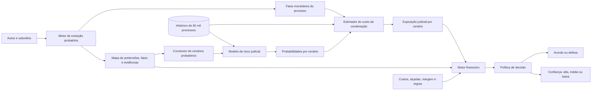

# Arquitetura do Motor de Decisão Jurídico-Financeira

## Objetivo

A solução recomenda uma de duas ações para cada processo, sempre acompanhada de um nível de confiança:

- **ACORDO**;
- **DEFESA**.

A recomendação não é produzida por um classificador de acordo versus defesa. Ela resulta da combinação de:

1. leitura rastreável dos autos e subsídios;
2. risco judicial estimado a partir do histórico de 60 mil processos;
3. custo possível de cada desfecho, usando os valores do processo;
4. comparação econômica entre acordo e defesa;
5. controles de incerteza, alçada e integridade probatória, que definem o nível de confiança.

Os fatos probatórios são usados **na solução atual** por dois caminhos. Fatos sobre a qualidade e a disponibilidade da prova alteram os cenários nos quais o risco é recalculado. Fatos monetários confirmados ou contestados alteram diretamente os componentes de custo desses mesmos cenários. Como a base histórica possui somente a presença ou ausência dos seis subsídios, um fato contestado não recebe um peso probabilístico arbitrário: ele altera estados que podem ser simulados e auditados.

## Visão geral



## 1. Motor de extração probatória

### Entradas

- autos do processo;
- contrato, extrato, comprovante de crédito, dossiê, demonstrativo de evolução da dívida e laudo referenciado;
- metadados do processo, como UF, assunto e subassunto.

### Processamento

1. classifica a qualidade de cada página e decide se precisa de OCR;
2. preserva documento, página e trecho de origem;
3. identifica pretensões e alegações da parte autora;
4. extrai fatos probatórios atômicos;
5. extrai fatos monetários;
6. liga cada fato às alegações que ele sustenta ou refuta;
7. deduplica fatos repetidos em documentos diferentes;
8. detecta contradições, lacunas e inconsistências aritméticas;
9. valida deterministicamente identidade, datas, valores, parcelas e somas.

### Ontologia probatória

```text
Pretensão
  └── Alegação
        └── Relação probatória
              ├── sustenta
              ├── refuta
              └── neutra
                    └── Fato probatório
                          └── Artefato, página e trecho
```

As pretensões são separadas em:

- contratação e responsabilidade;
- danos materiais;
- danos morais;
- pedidos processuais e acessórios.

### Confianças separadas

O sistema não produz um único “score de força”. Ele registra:

| Campo | Significado |
|---|---|
| `extraction_confidence` | confiança de que o texto ou valor foi extraído corretamente |
| `relation` | se o fato sustenta, refuta ou é neutro em relação à alegação |
| `relation_confidence` | confiança de que essa relação foi identificada corretamente |
| `source_grade` | natureza da fonte: primária, secundária, declaratória ou ausente |
| `verification_status` | confirmado, contestado, não verificável ou inconsistente |

`relation_confidence` não representa probabilidade de vitória. Ela mede apenas a confiança na ligação semântica entre o fato e a alegação.

### Saída

```json
{
  "claims": [
    {
      "id": "MAT-001",
      "category": "material_damage",
      "description": "Restituição em dobro dos descontos",
      "requested_amount": 2880.0
    }
  ],
  "facts": [
    {
      "id": "FAT-031",
      "description": "Foram descontadas oito parcelas de R$ 180",
      "extraction_confidence": 0.99,
      "source": {
        "document": "demonstrativo_divida.pdf",
        "page": 1,
        "excerpt": "8 de 84 parcelas liquidadas"
      }
    }
  ],
  "evidence_relations": [
    {
      "fact_id": "FAT-031",
      "claim_id": "MAT-001",
      "relation": "supports",
      "relation_confidence": 0.97,
      "source_grade": "primary_internal"
    }
  ],
  "contradictions": [],
  "gaps": [],
  "monetary_facts": {}
}
```

## 2. Construtor de cenários probatórios

Esta camada é a ligação entre os documentos e o modelo de risco na versão atual.

### Por que usar cenários

O histórico de 60 mil processos informa somente se cada tipo de subsídio estava disponível. Ele não possui os fatos extraídos do conteúdo dos PDFs. Portanto, não é possível afirmar que um vídeo de liveness ausente reduz a chance de improcedência em um percentual aprendido.

É possível, porém, avaliar o caso nos estados que o modelo conhece:

- documento disponível e utilizável: indicador `1`;
- documento ausente ou materialmente inutilizável: indicador `0`;
- documento contestado: avaliar os dois estados, `0` e `1`.

### Estados dos artefatos

| Estado | Tratamento |
|---|---|
| Confirmado e consistente | permanece disponível em todos os cenários |
| Ausente ou ilegível | permanece indisponível em todos os cenários |
| Materialmente contestado | disponível no cenário favorável e indisponível no adverso |
| Internamente inconsistente | valor é recalculado; se não for reconciliável, torna-se contestado |
| Identidade incompatível | artefato é inutilizável e gera alerta crítico |

### Cenários produzidos

```text
Cenário documental:
  usa a disponibilidade nominal informada na planilha

Cenário verificado:
  considera somente artefatos cuja evidência primária foi confirmada

Cenário adverso:
  retira artefatos com contradição material ou lacuna que possa impedir seu uso
```

O sistema não declara que esses cenários são efeitos causais. Eles são um teste de sensibilidade dentro do espaço de variáveis conhecido pelo modelo.

### Exemplo

No Caso 2, o comprovante declara que o crédito foi enviado para conta de titularidade do autor, mas essa titularidade é contestada e não existe extrato externo no pacote. O indicador de comprovante é avaliado como:

```text
Cenário documental: comprovante = 1
Cenário verificado: comprovante = 0
Cenário adverso:   comprovante = 0
```

O laudo continua registrado como presente, mas gera uma lacuna crítica porque menciona autenticação por liveness e informa que o vídeo não foi localizado. A ausência do artefato primário não é convertida em um desconto monetário; ela amplia a faixa de risco e reduz a confiança da recomendação.

### Saída

Um conjunto de vetores compatíveis com o modelo histórico e as hipóteses monetárias de cada cenário:

```json
{
  "documented": {
    "contract": 0,
    "statement": 0,
    "credit_proof": 1,
    "dossier": 0,
    "debt_evolution": 1,
    "referenced_report": 1
  },
  "verified": {
    "contract": 0,
    "statement": 0,
    "credit_proof": 0,
    "dossier": 0,
    "debt_evolution": 1,
    "referenced_report": 1
  },
  "monetary_scenarios": {
    "documented": {
      "credited_amount_recoverable": 8500.0
    },
    "verified": {
      "credited_amount_recoverable": null
    },
    "adverse": {
      "credited_amount_recoverable": 0.0
    }
  },
  "critical_alerts": [
    "unverified_credit_account_ownership",
    "missing_liveness_artifact",
    "missing_acceptance_term"
  ]
}
```

## 3. Modelo de risco judicial

### Entradas

Para cada cenário probatório:

- UF;
- assunto;
- subassunto;
- valor da causa, se disponível no momento da decisão;
- indicadores dos seis subsídios.

### Processamento

Um classificador supervisionado treinado nos resultados históricos estima quatro classes, usadas pelo motor financeiro.

### Saída

```json
{
  "scenario": "verified",
  "probabilities": {
    "extinction": 0.15,
    "dismissal": 0.45,
    "partial": 0.25,
    "judgment_for_claimant": 0.15
  }
}
```

As probabilidades são calculadas para todos os cenários. A diferença entre elas materializa quanto a decisão depende de uma evidência contestada.

## 4. Estimador do custo da condenação

O estimador não recebe “quantidade de argumentos”. Ele recebe probabilidades por cenário, fatos monetários auditáveis, o estado de verificação desses fatos e referências históricas de condenação.

### Entradas documentais

- valor da causa;
- valor creditado;
- número e valor das parcelas descontadas;
- valor total descontado, preferencialmente recalculado;
- saldo devedor, preferencialmente recalculado;
- restituição simples ou em dobro pedida;
- indenização moral pedida;
- cancelamento do contrato ou saldo pedido;
- datas relevantes para atualização monetária.

Fatos confirmados permanecem iguais em todos os cenários. Valores contestados variam de maneira explícita. Por exemplo, no Caso 2, o comprovante informa crédito de R$ 8.500, mas a titularidade da conta está contestada. O valor liberado é um fato confirmado; sua recuperabilidade em eventual derrota não é. Portanto, a recuperação pode ser R$ 8.500 no cenário documental, desconhecida no verificado e R$ 0 no cenário adverso. Isso altera diretamente o custo líquido da procedência.

### Entradas históricas

- distribuição do valor de condenação por resultado;
- UF, assunto, subassunto e faixa de valor da causa;
- mediana e quantis da condenação para o segmento.

O histórico serve como referência de severidade, não como busca semântica por processos parecidos.

### Validação financeira

Antes de estimar o custo, valores derivados são recalculados:

```text
total_descontado = parcelas_pagas × valor_parcela
restituicao_simples = total_descontado
restituicao_dobro = 2 × total_descontado
saldo_atual = saldo após a última parcela efetivamente paga
```

Se o resumo de um demonstrativo divergir da própria tabela, prevalece o cálculo reproduzível e a divergência é preservada como alerta.

### Custo por desfecho

Para cada resultado judicial `o` e cenário probatório `s`, o motor constrói `L(o, F_s, θ)`, em que:

- `F_s` são os fatos monetários e suas hipóteses verificadas naquele cenário;
- `θ` são premissas explícitas, como honorários, custas e regra de restituição.

```text
L_extinção = custos processuais aplicáveis

L_improcedência = custos de defesa aplicáveis

L_parcial = restituição do cenário parcial
            + condenação histórica compatível
            + honorários e custas
            + efeito contratual aplicável

L_procedência = restituição do cenário adverso
                + condenação histórica compatível
                + honorários e custas
                + baixa ou cancelamento do saldo
                - recuperação ou compensação permitida
```

Quando a base histórica não separa dano material, dano moral e honorários, o valor histórico total não deve ser somado cegamente aos componentes documentais. Ele é usado como benchmark de total, e o sistema apresenta a memória de cálculo e o intervalo resultante.

### Exposição por cenário

Para cada cenário probatório `s`:

```text
exposição_judicial(s) = Σ P(resultado = o | cenário s) × L(o, F_s, θ)

custo_defesa(s) = exposição_judicial(s) + custo_jurídico_da_defesa
```

### Saída

```json
{
  "documented_scenario": {
    "expected_exposure": 4200.0,
    "range": [2800.0, 6900.0]
  },
  "verified_scenario": {
    "expected_exposure": 6100.0,
    "range": [3900.0, 9800.0]
  },
  "adverse_scenario": {
    "expected_exposure": 7900.0,
    "range": [5100.0, 12500.0]
  },
  "calculation_trace": []
}
```

Os números acima ilustram o contrato de saída; não são estimativas dos casos fornecidos.

## 5. Motor financeiro e política de decisão

### Entradas

- custo esperado da defesa em cada cenário probatório;
- faixa de condenação em cada cenário;
- ofertas de acordo candidatas;
- custo operacional da negociação;
- efeitos do acordo sobre restituição, saldo e contrato;
- margem de segurança e alçadas configuradas;
- alertas críticos e confiança de extração.

### Custo do acordo

Para uma oferta aceita `a`:

```text
custo_acordo(a) = a
                  + custo_de_negociação
                  + restituições e concessões do termo
                  + baixa de saldo aplicável
                  - recuperação ou compensação aplicável
```

Como a base não possui ofertas, contrapropostas e aceites, a versão inicial não inventa uma curva de aceitação. Ela calcula o custo assumindo que a oferta candidata foi aceita e apresenta o limite econômico da negociação.

### Teto econômico

Para cada cenário `s`:

```text
teto_acordo(s) = custo_defesa(s)
                 - custo_de_negociação
                 - margem_de_segurança
                 - demais_concessões_do_acordo
                 + recuperações_previstas
```

O intervalo de tetos mostra quanto a política depende de fatos probatórios contestados.

### Regra de decisão

A ação é sempre **ACORDO** ou **DEFESA**, acompanhada de um nível de confiança (alta, média ou baixa):

```text
Se o acordo é economicamente preferível e respeita as alçadas:
    ACORDO

Senão:
    DEFESA
```

Incerteza, alertas críticos e evidência contestada **não mudam o tipo de ação**. Eles reduzem a confiança, e os motivos são registrados e exibidos ao advogado, que decide seguir ou divergir da recomendação. O critério exato de confiança ainda está em definição.

Uma decisão é robusta quando permanece a mesma nos cenários documental, verificado e adverso. Essa regra faz com que a evidência documental participe da decisão agora:

```text
Fato contestado
  → muda o estado probatório
  → muda as probabilidades
  → muda a exposição judicial
  → pode mudar o teto de acordo
  → pode mudar a ação final ou a confiança
```

### Saída para o advogado

```json
{
  "action": "AGREEMENT",
  "confidence": "low",
  "reason": "A decisão muda quando o comprovante contestado é desconsiderado",
  "defense_cost": {
    "central": 6100.0,
    "range": [4200.0, 7900.0]
  },
  "agreement": {
    "suggested_range": [4300.0, 5200.0],
    "economic_ceiling": 5600.0
  },
  "critical_evidence": [],
  "assumptions": [],
  "policy_version": "v1"
}
```

## 6. Papel das contradições

Contradições têm três efeitos possíveis:

| Tipo | Efeito |
|---|---|
| Alegação da parte versus documento confirmado | explica por que a evidência sustenta ou refuta a pretensão |
| Dois documentos internos incompatíveis | recalcula valores e cria cenário adverso |
| Ausência de artefato primário essencial | amplia a faixa de risco e reduz a confiança |

Uma contradição nunca é convertida diretamente em reais. Ela altera a utilização da evidência, o cenário de risco e, por consequência, a exposição esperada.

## 7. Rastreabilidade e monitoramento

Cada recomendação deve persistir:

- versão dos modelos e da política;
- documentos e páginas utilizados;
- fatos extraídos e respectivas confianças;
- cenários probatórios avaliados;
- probabilidades e custos por cenário;
- ação recomendada e teto de acordo;
- ação tomada pelo advogado;
- justificativa estruturada para divergência;
- resultado da negociação ou do processo.

Esses registros permitem medir aderência e efetividade e alimentar o retreino periódico sem alterar silenciosamente a política em produção.

## 8. Limitações assumidas

- Os 60 mil registros não contêm o conteúdo integral dos documentos; por isso, a contribuição probatória atual é uma análise de sensibilidade, não um efeito causal aprendido.
- O valor histórico de condenação é agregado e pode não separar dano material, moral, honorários e outros componentes.
- Custos de defesa, negociação, alçadas e curva de aceitação não foram fornecidos; são parâmetros explícitos da política.
- Somente dois casos completos foram disponibilizados. Eles demonstram a extração e a decisão, mas não validam estatisticamente os scores semânticos.
- Scores da LLM não são probabilidades judiciais e não devem ser apresentados como tais.
