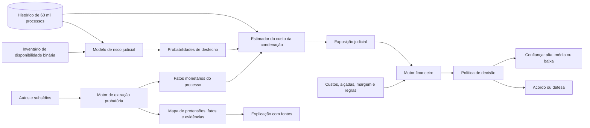

# Arquitetura do Motor de Decisão Jurídico-Financeira

## Objetivo

A solução recomenda uma de duas ações para cada processo, sempre acompanhada de um nível de confiança:

- **ACORDO**;
- **DEFESA**.

A recomendação não é produzida por um classificador de acordo versus defesa. Ela resulta da combinação de:

1. leitura rastreável dos autos e subsídios;
2. risco judicial estimado a partir do histórico de 60 mil processos;
3. custo possível de cada desfecho, usando os valores do processo;
4. comparação econômica entre acordo e defesa;
5. controles de incerteza do modelo, qualidade da extração e alçada, que definem o nível de confiança.

**Escopo atual — disponibilidade binária:** o modelo recebe apenas os metadados do processo e os seis indicadores de subsídios disponibilizados. `1` significa disponível e `0` indisponível, conforme o inventário de entrada. O sistema não contesta nem valida a existência, autenticidade, validade ou força probatória de um documento. Não existem cenários documental, verificado ou adverso que alterem essas flags. A extração com fontes apoia a explicação e os valores financeiros; não reclassifica a disponibilidade.

## Visão geral



## 1. Motor de extração probatória

### Entradas

- autos do processo;
- contrato, extrato, comprovante de crédito, dossiê, demonstrativo de evolução da dívida e laudo referenciado;
- metadados do processo, como UF, assunto e subassunto.

### Processamento

1. classifica a qualidade de cada página e decide se precisa de OCR;
2. preserva documento, página e trecho de origem;
3. identifica pretensões e alegações da parte autora;
4. extrai fatos probatórios atômicos;
5. extrai fatos monetários;
6. liga cada fato às alegações que ele sustenta ou refuta;
7. deduplica fatos repetidos em documentos diferentes;
8. registra divergências de conteúdo para leitura humana e inconsistências aritméticas;
9. confere o formato dos dados extraídos e recalcula parcelas e somas, sem validar documentos ou alterar flags.

### Ontologia probatória

```text
Pretensão
  └── Alegação
        └── Relação probatória
              ├── sustenta
              ├── refuta
              └── neutra
                    └── Fato probatório
                          └── Artefato, página e trecho
```

As pretensões são separadas em:

- contratação e responsabilidade;
- danos materiais;
- danos morais;
- pedidos processuais e acessórios.

### Confianças separadas

O sistema não produz um único “score de força”. Ele registra:

| Campo | Significado |
|---|---|
| `extraction_confidence` | confiança de que o texto ou valor foi extraído corretamente |
| `relation` | se o fato sustenta, refuta ou é neutro em relação à alegação |
| `relation_confidence` | confiança de que essa relação foi identificada corretamente |
| `source_grade` | natureza da fonte: primária, secundária, declaratória ou ausente |

`relation_confidence` não representa probabilidade de vitória. Ela mede apenas a confiança na ligação semântica entre o fato e a alegação.

### Saída

```json
{
  "claims": [
    {
      "id": "MAT-001",
      "category": "material_damage",
      "description": "Restituição em dobro dos descontos",
      "requested_amount": 2880.0
    }
  ],
  "facts": [
    {
      "id": "FAT-031",
      "description": "Foram descontadas oito parcelas de R$ 180",
      "extraction_confidence": 0.99,
      "source": {
        "document": "demonstrativo_divida.pdf",
        "page": 1,
        "excerpt": "8 de 84 parcelas liquidadas"
      }
    }
  ],
  "evidence_relations": [
    {
      "fact_id": "FAT-031",
      "claim_id": "MAT-001",
      "relation": "supports",
      "relation_confidence": 0.97,
      "source_grade": "primary_internal"
    }
  ],
  "contradictions": [],
  "gaps": [],
  "monetary_facts": {}
}
```

## 2. Disponibilidade binária dos subsídios

O histórico informa se cada tipo de subsídio foi disponibilizado. A inferência mantém esse mesmo significado:

| Indicador | Significado |
|---|---|
| `1` | Subsídio disponível no inventário de entrada |
| `0` | Subsídio indisponível no inventário de entrada |

O vetor é fornecido pelo cadastro/inventário do caso, sem etapa de validação da existência do documento. Ilegibilidade ou divergência de conteúdo não convertem `1` em `0`. Falhas de OCR são tratadas na extração, separadamente. Disponibilidade desconhecida é entrada incompleta e não deve ser silenciosamente convertida em ausência.

Cada análise usa um único vetor. Não há remoção hipotética de documentos nem exigência de concordância entre cenários probatórios.

```json
{
  "contract": 0,
  "statement": 0,
  "credit_proof": 1,
  "dossier": 0,
  "debt_evolution": 1,
  "referenced_report": 1
}
```

O exemplo ilustra disponibilidade, não qualidade ou autenticidade da prova.

## 3. Modelo de risco judicial

### Entradas

Para o vetor de disponibilidade informado:

- UF;
- assunto;
- subassunto;
- valor da causa, se disponível no momento da decisão;
- indicadores dos seis subsídios.

### Processamento

Um classificador supervisionado treinado nos resultados históricos estima quatro classes, usadas pelo motor financeiro.

### Saída

```json
{
  "probabilities": {
    "extinction": 0.15,
    "dismissal": 0.45,
    "partial": 0.25,
    "judgment_for_claimant": 0.15
  }
}
```

As probabilidades são calculadas uma vez por vetor de entrada. O conteúdo extraído não altera as flags nem adiciona pesos probatórios ao modelo.

## 4. Estimador do custo da condenação

O estimador não recebe “quantidade de argumentos”. Ele recebe probabilidades de desfecho, valores extraídos com suas fontes e referências históricas de condenação.

### Entradas documentais

- valor da causa;
- valor creditado;
- número e valor das parcelas descontadas;
- valor total descontado, preferencialmente recalculado;
- saldo devedor, preferencialmente recalculado;
- restituição simples ou em dobro pedida;
- indenização moral pedida;
- cancelamento do contrato ou saldo pedido;
- datas relevantes para atualização monetária.

Os valores extraídos formam um único conjunto de entradas financeiras. Recuperação, compensação e demais efeitos econômicos são premissas explícitas da política; não são inferidos da validade ou autenticidade documental. Valor necessário ausente ou não extraível exige complemento ou revisão, sem modificar a disponibilidade do subsídio.

### Entradas históricas

- distribuição do valor de condenação por resultado;
- UF, assunto, subassunto e faixa de valor da causa;
- mediana e quantis da condenação para o segmento.

O histórico serve como referência de severidade, não como busca semântica por processos parecidos.

### Validação financeira

Antes de estimar o custo, valores derivados são recalculados:

```text
total_descontado = parcelas_pagas × valor_parcela
restituicao_simples = total_descontado
restituicao_dobro = 2 × total_descontado
saldo_atual = saldo após a última parcela efetivamente paga
```

Se o resumo de um demonstrativo divergir da própria tabela, prevalece o cálculo reproduzível e a divergência é preservada como alerta.

### Custo por desfecho

Para cada resultado judicial `o`, o motor constrói `L(o, F, θ)`, em que:

- `F` são os valores extraídos e as premissas financeiras registradas;
- `θ` são premissas explícitas, como honorários, custas e regra de restituição.

```text
L_extinção = custos processuais aplicáveis

L_improcedência = custos de defesa aplicáveis

L_parcial = restituição aplicável à procedência parcial
            + condenação histórica compatível
            + honorários e custas
            + efeito contratual aplicável

L_procedência = restituição aplicável à procedência
                + condenação histórica compatível
                + honorários e custas
                + baixa ou cancelamento do saldo
                - recuperação ou compensação permitida
```

Quando a base histórica não separa dano material, dano moral e honorários, o valor histórico total não deve ser somado cegamente aos componentes documentais. Ele é usado como benchmark de total, e o sistema apresenta a memória de cálculo e o intervalo resultante.

### Exposição judicial

Para as entradas do caso:

```text
exposição_judicial = Σ P(resultado = o | entradas) × L(o, F, θ)

custo_defesa = exposição_judicial + custo_jurídico_da_defesa
```

### Saída

```json
{
  "expected_exposure": 6100.0,
  "range": [3900.0, 9800.0],
  "calculation_trace": []
}
```

Os números acima ilustram o contrato de saída; não são estimativas dos casos fornecidos.

## 5. Motor financeiro e política de decisão

### Entradas

- custo esperado da defesa para o caso;
- faixa estimada de condenação;
- ofertas de acordo candidatas;
- custo operacional da negociação;
- efeitos do acordo sobre restituição, saldo e contrato;
- margem de segurança e alçadas configuradas;
- dados necessários ao cálculo e confiança de extração.

### Custo do acordo

Para uma oferta aceita `a`:

```text
custo_acordo(a) = a
                  + custo_de_negociação
                  + restituições e concessões do termo
                  + baixa de saldo aplicável
                  - recuperação ou compensação aplicável
```

Como a base não possui ofertas, contrapropostas e aceites, a versão inicial não inventa uma curva de aceitação. Ela calcula o custo assumindo que a oferta candidata foi aceita e apresenta o limite econômico da negociação.

### Teto econômico

Para as premissas financeiras informadas:

```text
teto_acordo = custo_defesa
                 - custo_de_negociação
                 - margem_de_segurança
                 - demais_concessões_do_acordo
                 + recuperações_previstas
```

A incerteza financeira deve refletir a estimação de custos e as premissas econômicas, sem simular contestação documental.

### Regra de decisão

A ação é sempre **ACORDO** ou **DEFESA**, acompanhada de um nível de confiança (alta, média ou baixa):

```text
Se o acordo é economicamente preferível e respeita as alçadas:
    ACORDO

Senão:
    DEFESA
```

Incerteza do modelo, qualidade da extração e premissas econômicas são comunicadas no nível de confiança, com os motivos exibidos ao advogado. O critério exato de confiança ainda está em definição. A política usa um único vetor de disponibilidade; não testa concordância entre cenários probatórios.

### Saída para o advogado

```json
{
  "action": "AGREEMENT",
  "confidence": "low",
  "reason": "A comparação econômica depende de premissas de custo ainda não confirmadas",
  "defense_cost": {
    "central": 6100.0,
    "range": [4200.0, 7900.0]
  },
  "agreement": {
    "suggested_range": [4300.0, 5200.0],
    "economic_ceiling": 5600.0
  },
  "critical_evidence": [],
  "assumptions": [],
  "policy_version": "v1"
}
```

## 6. Papel da extração e das divergências de conteúdo

A extração conserva fatos, alegações e fontes para o advogado consultar. Divergências textuais podem ser apresentadas como observações, sem declarar um documento válido, inválido ou inexistente. Elas não alteram os indicadores, não geram cenários probatórios e não recebem pesos de risco.

Conferência aritmética e tratamento de erro de OCR são controles de cálculo e extração, não validação documental.

## 7. Rastreabilidade e monitoramento

Cada recomendação deve persistir:

- versão dos modelos e da política;
- documentos e páginas utilizados;
- fatos extraídos e respectivas confianças;
- vetor de disponibilidade binária utilizado;
- probabilidades de desfecho, custos e premissas;
- ação recomendada e teto de acordo;
- ação tomada pelo advogado;
- justificativa estruturada para divergência;
- resultado da negociação ou do processo.

Esses registros permitem medir aderência e efetividade e alimentar o retreino periódico sem alterar silenciosamente a política em produção.

## 8. Limitações assumidas

- Os 60 mil registros contêm disponibilidade binária, não qualidade documental. O modelo aprende associações com disponibilidade; não avalia validade da prova nem efeitos causais.
- O valor histórico de condenação é agregado e pode não separar dano material, moral, honorários e outros componentes.
- Custos de defesa, negociação, alçadas e curva de aceitação não foram fornecidos; são parâmetros explícitos da política.
- Somente dois casos completos foram disponibilizados. Eles demonstram a extração e a decisão, mas não validam estatisticamente os scores semânticos.
- Scores da LLM não são probabilidades judiciais e não devem ser apresentados como tais.
